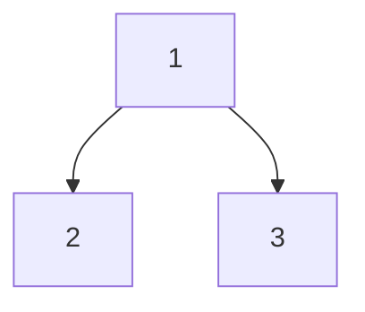
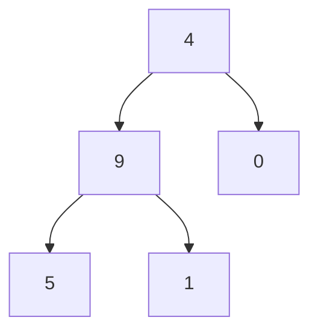

მოცემულია ბინარული ხე `root`, რომელიც შეიცავს მხოლოდ `0`-დან `9`-მდე ციფრებს.

ხის თითოეული ძირიდან **ფოთლამდე** მიმავალი გზა წარმოადგენს ციფრულ მნიშვნელობას.

მაგალითად, ძირიდან ფოთლამდე გზა `1 -> 2 -> 3` წარმოადგენს ნომერს `123`.

თქვენი დავალებაა დააბრუნოთ ყველა ძირიდან ფოთლამდე გზის საერთო ჯამი.

:::info
**ფოთოლი** არის ელემენტი, რომელსაც არ აქვს შვილობილი (node) ელემენტები.
:::

გადაცემული პარამეტრებიდან გამომდინარე ამოცანას აუცილებლად ექნება **ერთი სწორი პასუხი**.

### პირველი მაგალითი

- პარამეტრები: `root = [1, 2, 3]`
- შედეგი: `25`
- განმარტება:
  - ფოთლამდე მისასვლელ გზაზე გვაქვს `1 -> 2`, რომელიც წარმოადგენს `12`-ს.
  - ფოთლამდე მისასვლელ გზაზე გვაქვს `1 -> 3`, რომელიც წარმოადგენს `13`-ს.
  - შედეგად, გვაქვს: `12 + 13 = 25`

### მეორე მაგალითი

- პარამეტრები: `root = [4, 9, 0, 5, 1]`
- შედეგი: `1026`
- განმარტება:
  - ფოთლამდე მისასვლელ გზაზე გვაქვს `4 -> 0`, რომელიც წარმოადგენს `40`-ს.
  - ფოთლამდე მისასვლელ გზაზე გვაქვს `4 -> 9 -> 5`, რომელიც წარმოადგენს `495`-ს.
  - ფოთლამდე მისასვლელ გზაზე გვაქვს `4 -> 9 -> 1`, რომელიც წარმოადგენს `491`-ს.
  - შედეგად, გვაქვს: `495 + 491 + 40 = 1026`

### შეზღუდევები

- ხეში ელემენტების რაოდენობა არის დიაპაზონში `[1, 1000]`.
- `0 ≤ Node.val ≤ 9`
- ხის სიღრმე არ აღემატება 10-ს.

ამოცანის ამოხსნა შესაძლებელია ბევრი გზით,
ცადეთ ისეთი ალგორითმის მოფიქრება, რომელიც `O(n)`-თან ახლოს არის.