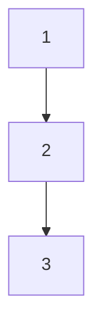
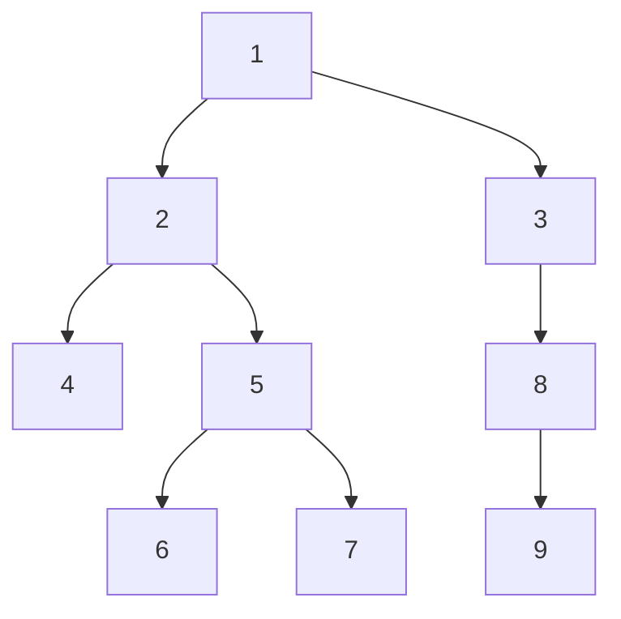

მოცემული `root` ბინარული ხიდან, დააბრუნეთ მისი კვანძების მნიშვნელობები,
წინა რიგის გავლით გადაადგილების თანმიმდევრობით (Preorder Traversal).

გადაცემული პარამეტრებიდან გამომდინარე ამოცანას აუცილებლად ექნება **ერთი სწორი პასუხი**.

### პირველი მაგალითი

- პარამეტრები: `root = [1, null, 2, 3]`
- შედეგი: `[1, 2, 3]`
- განმარტება:

### მეორე მაგალითი

- პარამეტრები: `root = [1, 2, 3, 4, 5, null, 8, null, null, 6, 7, 9]`
- შედეგი: `[1, 2, 4, 5, 6, 7, 3, 8, 9]`
- განმარტება:

### მესამე მაგალითი

- პარამეტრები: `root = []`
- შედეგი: `[]`
- განმარტება: ბინარული ხე ცარიელია, შედეგიც ცარიელია

### მეოთხე მაგალითი

- პარამეტრები: `root = [1]`
- შედეგი: `[1]`

### შეზღუდევები

- კვანძების რაოდენობა არის მოცემულ `[0, 100]` დიაპაზონში.
- `-100 <= Node.val <= 100`

ამოცანის ამოხსნა შესაძლებელია ბევრი გზით,
ცადეთ ისეთი ალგორითმის მოფიქრება, რომელიც `O(n)`-თან ახლოს არის.

**შემდეგი ამოხსნა**: ამ ამოცანის რეკურსიული ამოხსნა ტრივიალურია,
შეგიძლიათ გააკეთო ეს იტერაციულად?