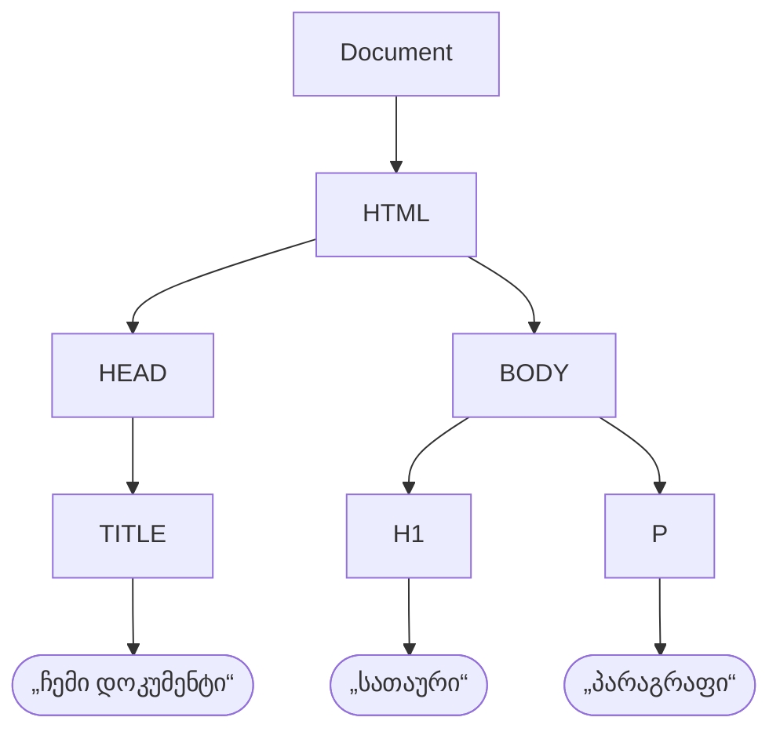

## HTML & CSS

ცარიელი გვერდი (შევავსებთ მერე)

```mermaid
flowchart TD
Document --> HTML
HTML --> HEAD
HTML --> BODY
HEAD --> TITLE
TITLE --> titleContent(["„ჩემი დოკუმენტი“"])
BODY --> H1
BODY --> P
H1 --> h1Content(["„სათაური“"])
P --> pContent(["„პარაგრაფი“"])
```
