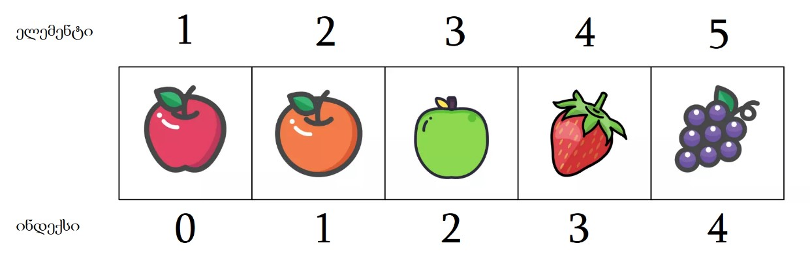

მასივი არის ცვლადის ტიპი, რომელშიც შეიძლება შევინახოთ ერთდროულად რამოდენიმე ტიპის მნიშვნელობა. განვმარტოთ უფრო დეტალურად: მასივი ეს არის მონაცემთა ჩაწერის ტიპი, რომელიც შედგება მონაცემთა დანომრილი ფრაგმენტებისაგან, ამ ფრაგმენტს ეწოდება მასივის ელემენტი ხოლო ფრაგმენტების ნომრებს ეწოდება ინდექსები, ან შეიძლება ითქვას, რომ მასივი ეს არის ერთგანზომილებიანი ვექტორი.

## ინდექსები და მათზე წვდომა

Javascript-ში მასივის ელემენტები შეიძლება შეიცავდნენ სხვადასხვა ტიპის მნიშვნელობებს. მასივის ერთ-ერთი დადებითი თვისება არის დინამიურობა. დინამიურობა იგულისხმება, რომ შეიძლება ელემენტი, როგორც დაემატოს ასევე წაიშალოს. მასივის ინდექსაცია იწყება 0 დან, მაგრამ ეს ნაწილი არ გულისხმობს იმას, რომ მასივში `n-1` ელემენტია. მაგალითად: თუ მასივში არის 10 ელემენტი, მასივის სიგრძე დარჩება 10 მაგრამ ინდექსების მიხედვით შეგვიძლია 10-ვე ელემენტს მივწდეთ 0 დან დაწყებული.



მაგალითისთვის განვიხილოთ სურათი: სულ არის 5 ელემენტი, მე-4 ელემენტი(მარწყვი) არის მოთავსებული მე-3 ინდექსზე. მე-5 ინდექსის ელემენტზე, რომ მოვახდინოთ წვდომა დააბრუნბს `undefined`-ს რადგან მე-5 ინდექსის ელემენტი არ არის ამჟამინდელ მასივში მოთავსებული.

```js
const fruits = ['წითელი ვაშლი', 'ფორთოხალი', 'მწვანე ვაშლი', 'მარწყვი', 'ყურძენი'];
console.log(fruits[0]); // 'წითელი ვაშლი'
console.log(fruits[1]); // 'ფორთოხალი'
console.log(fruits[2]); // 'მწვანე ვაშლი'
console.log(fruits[3]); // 'მარწყვი'
console.log(fruits[4]); // 'ყურძენი'
console.log(fruits[5]); // undefined
```

მასივის ელემენტს, რომ მივწდეთ საჭიროა `[]` ფრჩხილების გამოყენება. სინტაქსი არის შემდგომი: `მასივის_სახელი[ინდექსი]`.

## ორგანზომილებიანი მასივი

მასივი შესაძლოა იყოს: ერთგანზომილებიანი, ორგანზომილებიანი და მრავალგანზომილებიანი.

ორგანზომილებიან მასივს ეწოდება **მატრიცა**. ელემენტებზე წვდომა შეიძლება უკვე არა ერთი ინდექსით არამედ ორით. განვიხილოთ მაგალითისთვის ა მატრიცა, რომლის განზომილებები არის: 3x3-ზე.

| პირველი სვეტი             | მეორე სვეტი               | მესამე სვეტი              |
| ------------------------- | ------------------------- | ------------------------- |
| a<sub>0</sub><sub>0</sub> | a<sub>0</sub><sub>1</sub> | a<sub>0</sub><sub>2</sub> |
| a<sub>1</sub><sub>0</sub> | a<sub>1</sub><sub>1</sub> | a<sub>1</sub><sub>2</sub> |
| a<sub>2</sub><sub>0</sub> | a<sub>2</sub><sub>1</sub> | a<sub>2</sub><sub>2</sub> |

მოცემულ მატრიცაში ელემენტები მოთავსებული არის ორი მიმართულებით: row(სტრიქონი) და column(სვეტი) მიხედვით, ელემენტებზე წვდომისათვისაც საჭიროა ორივე მიმართულების გამოყენება.
სინტაქსი არის შემდეგნაირად: `მასივის_სახელი[სტრიქონი][სვეტი]`.

მაგალითად მივწდეთ a<sub>0</sub><sub>1</sub>-ს: `a[0][1]`.

პრაქტიკაში მსგავსი მასივი, რომ დავწეროთ საჭიროა შემდგომი სინტაქსი JavaScript-ში:

```js
const matrix = [
  [1, 2, 3],
  [4, 5, 6],
  [7, 8, 9],
];
```

მცირედი დავალება: 8-ს, რომ მივწდეთ, რომელი ინდექსი უნდა გამოვიყენოთ (პახუსის შესამოწმებლად კონსოლში გაუშვი კოდი) ?

## მასივის თვისებები და მეთოდები

### length

მასივში ელემენტების რაოდენობის დასათვლელად გამოიყენება [`length`](https://developer.mozilla.org/en-US/docs/Web/JavaScript/Reference/Global_Objects/Array/length) თვისება.

```js
const array = [1, 2, 3, 4, 5, 6, 7, 8, 9, 10];
console.log(array.length);
```

### push და unshift

მასივში ელემენტების დასამატებლად მეტწილადად გამოიყენება ორი მეთოდი: [`push`](https://developer.mozilla.org/en-US/docs/Web/JavaScript/Reference/Global_Objects/Array/push) და [`unshift`](https://developer.mozilla.org/en-US/docs/Web/JavaScript/Reference/Global_Objects/Array/unshift).

- `push` მეთოდი პარამეტრად ღებულობს ელემენტებს, ამატებს მასივის ბოლოში ელემენტს და აბრუნებს მასივის ახალ სიგრძეს.
- `unshift` მეთოდი პარამეტრად ღებულობს ელემენტებს, ამატებს მასივის დასაწყისში ელემენტს და აბრუნებს მასივის ახალ სიგრძეს.

```js
const randomNumbers = [2, 22];
console.log(randomNumbers); // [2, 22]
randomNumbers.push(1);
console.log(randomNumbers); // [2, 22, 1]
randomNumbers.push(7, 77);
console.log(randomNumbers); // [2, 22, 1, 7, 77]
randomNumbers.unshift(10);
console.log(randomNumbers); // [10, 2, 22, 1, 7, 77]
randomNumbers.unshift(0, -3);
console.log(randomNumbers); // [0, -3, 10, 2, 22, 1, 7, 77]
```

მსგავს ტიპად გამოყენებული მეთოდები მასივს უკეთებს **მუტაცია**-ს. მუტაცია გულისხმობს ორიგინალი მასივი მოდიფიცირებას. იხილეთ [ცხრილი მეთოდების](#რომელი_მეთოდი_უკეთებს_მუტაციას_მასივს_?), რომლებიც მასივს მუტაციას უკეთებს.

### pop და shift

მასივში ელემენტის დასაწყისიდან ან ბოლოდან წაშლისათვის გამოიყენება ორი მეთოდი: [`pop`](https://developer.mozilla.org/en-US/docs/Web/JavaScript/Reference/Global_Objects/Array/pop) და [`shift`](https://developer.mozilla.org/en-US/docs/Web/JavaScript/Reference/Global_Objects/Array/shift).

- `pop` მეთოდი პარამეტრად არაფერს ღებულობს, წაშლის ბოლო ელემენტს მასივიდან და დააბრუნებს წაშლილ ელემენტს, თუ ელემენტი არ იყო მასივში აბრუნებს [`undefined`](https://developer.mozilla.org/en-US/docs/Web/JavaScript/Reference/Global_Objects/undefined)-ს.
- `shift` მეთოდი პარამეტრად არაფერს ღებულობს, წაშლის პირველ ელემენტს მასივიდან და დააბრუნებს წაშლილ ელემენტს, თუ ელემენტი არ იყო მასივში აბრუნებს `undefined`-ს.

```js
const randomNumbers = [2, 22, 222];
console.log(randomNumbers.pop()); // 222
console.log(randomNumbers); // [2, 22]
console.log(randomNumbers.shift()); // 2
console.log(randomNumbers); // [22]
```

### indexOf და lastIndexOf

მასივში თუ არ ვიცით კონკრეტული ელემენტის ინდექსი, მისი პოვნისთვის შეგვიძლია შემდგომი მეთოდების გამოყენება: [`indexOf`](https://developer.mozilla.org/en-US/docs/Web/JavaScript/Reference/Global_Objects/Array/indexOf) და [`lastIndexOf`](https://developer.mozilla.org/en-US/docs/Web/JavaScript/Reference/Global_Objects/Array/lastIndexOf).

- `indexOf` მეთოდი ღებულობს ორ პარამეტრს: საძიებო ელემენტს (რისი პოვნაც გვინდა) და ინდექს (რომელი ინდექსიდან დავიწყოთ მოძებნა). მეთოდი აბრუნებს პირველივე ელემენტს, რომელსაც იპოვის.
- `lastIndexOf` მეთოდი ღებულობს ორ პარამეტრს: საძიებო ელემენტს (რისი პოვნაც გვინდა) და ინდექს (რომელი ინდექსიდან დავიწყოთ მოძებნა). მეთოდი აბრუნებს ბოლო ელემენტს, რომელსაც იპოვის.

```js
const web = ['HTML', 'CSS', 'SCSS', 'JS', 'TS', 'JS', 'Angular'];
console.log(web.indexOf('JS')); // 3
console.log(web.indexOf('JS', 4)); // 5
console.log(web.lastIndexOf('JS')); // 5
```

### findIndex

მასივში ელემენტის ინდექსის მოსაძებნად არამარტო `indexOf` და `lastIndexOf` გამოიყენება, არამედ შესაძლებელია [`findIndex`](https://developer.mozilla.org/en-US/docs/Web/JavaScript/Reference/Global_Objects/Array/findIndex) მეთოდის გამოყენებაც. `findIndex` მეთოდი ცოტათი განსხვავდება ზემოთ ხსენებული მეთოდებისაგან, წინა მეთოდებში კონკრეტულად ვიცოდით თუ რომელ ელემენტს ვეძებდით, რაც გამოსადეგია მარტივი ტიპის ელემენტებისთვის, მაგრამ ობიექტებთან ან პირობასთან მიმართებაში თუ ვეძებთ, ზემოთ ხსენებული მეთოდები არ გამოდგება.

მაგალითისთვის თქვათ, რომ გვაქვს მასივი სადაც არის რიცხვები, კონკრეტულად მაინტერესებს პირველი ელემენტის ინდექსი, რომელიც მეტია 10 ზე.

```js
const numbers = [2, 7, 22];
console.log(numbers.findIndex((number) => number > 10)); // 2
console.log(
  numbers.findIndex(function (number) {
    return number > 10;
  }),
);
```

კონკრეტული შემთხვევიდან გამომდინარე დაგვიბრუნა 2, რადგან მეორე ინდექსზე მდებარეობს ის ელემენტი, რომელიც მეტია 10-ზე. `findIndex` ისეთი ტიპის მეთოდია, რომელიც პარამეტრად ღებულობს `callbackFn`. `callbackFn` ფუნქციის საშუალებით, მთლიან მასივის ელემენტებზე გადავატარებთ [ციკლს](./guides/javascript/loop) (შემდგომ თავში იქნება განხილული ციკლები), თითოეულ ელემენტს წარმოვადგენთ, როგორც `number` (`number` ამ შემთხვევაში, პირობითი სახელია ნებისმიერი ცვლადის სახელი იმუშავებს), რომელსაც ვამოწმებთ მეტია თუ არა 10-ზე, რომელი ელემენტიც დააკმაყოფილებს არსებულ პირობას დააბრუნებს მის ინდექს. არსებულ შემთხვევაში გამოვიყენეთ, `arrow` ფუნქციაც და სტანდარტული ფუნქციაც. ტექნიკურად ამ მაგალითის კვალობაზე `arrow` ფუნქცია უფრო მოსახერხებელია ვიდრე სტანდარტული ფუნქცია, თუ დაგვჭირდება `this` გამოყენება, რეალურად `callbackFn` გააჩნია მე-3 პარამეტრი სადაც შესაძლებელია არსებული მასივი ამოვიღოთ. თუ არცეთი ელემენტი არ დააკმაყოფილებს პირობას მაშინ ავტომატურად დაბრუნდება `-1`. `-1` ინდექსი რეალურად არ არსებობს ამიტომაც ბევრი მეთოდი, მნიშვნელობის ვერ პოვნის დროს დააბრუნებს `-1` (როცა ინდექსებთან მიდის მოქმედებები).

## callbackFn როგორც მასივის პარამეტრი

სხვადასხვა მეთოდებში ხშირ შემთხვევაში გამოყენებული იქნება `callbackFn` ფუნქცია. მოდით დეტალურად განვიხილოთ თუ რისი გადაცემა არის შესაძლებელი `callbackFn` დროს. `callbackFn` ფუნქცია ღებულობს 3 პარამეტრს ესენია:

- element - კონკრეტული ელემენტი, რომელზეც მიმდინარეობს მოქმედება.
- index - რომელ ელემენტზეც მიმდინარეობს მოქმდება მისი ინდექსი.
- array - მთლიანი მასივი, რაზეც სხვადასხვა მოქმდებები მიმდინარეობს.

სამივე პარამეტრი არის **optional** პარამეტრი, რაც გულისხმობს რომ გადაცემა არ არის სავალდებულო. სამივე პარამეტრის წარმოდგენა შეიძლება ნებისმიერი სახელით, სასურველია სახელები იყოს [Camel case-ს სტილში](./guides/javascript/variable#ცვლადის_სახელის_სტილი) და აღწერდეს ცვლადის მნიშვნელობას. მაგალითისთვის თუ რიცხვების მასივი არის გამოვიყენოთ `number` თუ სახელების მასივია `name` და ა.შ.

## forEach

[`forEach`](https://developer.mozilla.org/en-US/docs/Web/JavaScript/Reference/Global_Objects/Array/foreach) მეთოდი უზრუნველყოფბს მასივის ყოველ ელემენტზე წვდომას რიგ-რიგობით. შესაძლებელია გამოვიყენოთ ისეთ დროს, როცა ყოველ ელემენტზე წვდომა გვსურს.

```js
const randomNumbers = [22, 7, 10, 30, 6, 11, 9];
randomNumbers.forEach((number, index, array) => {
  console.log(number); // დალოგავს იმ რიცხვს, რომელზეც არის იტერაცია (მოქმდებები)
  console.log(index); // დალოგავს იმ ელემენტის ინდექს, რომელზეც არის იტერაცია
  console.log(array); // დალოგავს მთლიან მასივს რაზეც არის მოქმდებები
});
randomNumbers.forEach((number, index) => {
  console.log(index, number); // დალოგავს იმ რიცხვს და ინდექს, რომელზეც მიდის მოქმდებები
});
randomNumbers.forEach((number) => {
  console.log(number); // დალოგავს იმ რიცხვს, რომელზეც არის იტერაცია (მოქმდებები)
});
```

სურვილისამებრ სხვადასხვა მეთოდებში შესაძლოა გამოვიყენოთ 3-ვე მეთოდის არგუმენტი ან საერთოდაც არცეთი (ძალიან იშვიათ შემთხვევებში პირველი არგუმენტი მაინც არის).

## join

[`join`](https://developer.mozilla.org/en-US/docs/Web/JavaScript/Reference/Global_Objects/Array/join) მეთოდი გამოიყენება იმისათვის, რომ მასივში არსებული ელემენტები გავაერთიანოთ ერთ ტექსტურ ცვლადში (სტრინგში). `join` გააჩნია ერთი პარამეტრი. ეს პარამეტრი შეგვიძლია დავიმახსოვროთ, როგორც separator (გამყოფი). რა პარამეტრსაც გადავცემთ გამყოფს, იმ სიმბოლო/ტექსტით იქნება დაყოფილი ტექსტში მასივის მნიშვნელობები, თუ არაფერი გადაეცა ესეიგი გამყოფის გამყოფის მნიშვნელობა იქნება `","`.

```js
const randomNumbers = [22, 7, 10, 30, 6, 11, 9];
console.log(randomNumbers.join()); // "22, 7, 10, 30, 6, 11, 9"
console.log(randomNumbers.join('/')); // "22/7/10/30/6/11/9"
const projects = ['iswavle', 'EverREST', 'educata'];
console.log(`Our projects ${projects.join()}`); // 'iswavle, EverREST, educata'
console.log(`Our projects ${projects.join('')}`); // 'iswavleEverRESTeducata'
console.log(`Our projects ${projects.join(' ')}`); // 'iswavle EverREST educata'
console.log(`Our projects ${projects.join('|')}`); // 'iswavle|EverREST|educata'
```

## concat

[`concat`](https://developer.mozilla.org/en-US/docs/Web/JavaScript/Reference/Global_Objects/Array/concat) მეთოდი გამოიყენება მასივების გასაერთიანებლად. მეთოდი პარამეტრად ღებულობს მასივს ან მასივებს. მეთოდი აბრუნებს გაერთიანებულ მასივს.

```js
const firstArray = [1, 2, 3, 4, 5];
const secondArray = [6, 7, 8, 9, 10];
const concatedArray = firstArray.concat(secondArray);
console.log(concatedArray); // მსგავს ტიპად შეიქმნება ახალი მასივი პირველი მასივის და მეორე მასივის ელემენტებით
```

## map

[`map`](https://developer.mozilla.org/en-US/docs/Web/JavaScript/Reference/Global_Objects/Array/map) მეთოდი გამოიყენება მასივის ელემენტების მოდიფიცირებებისათვის. მასივი პარამეტრად ღებულობს [callbackFn](#callbackFn_როგორც_მასივის_პარამეტრი) ფუნქციას. მეთოდი აბრუნებს ახალ მოდიფიცირებულ მასივს.

```js
const randomNumbers = [1, 2, 3, 4, 5];
const squareRandomNumbers = randomNumbers.map((number) => number * number);
console.log(squareRandomNumbers); // [1, 4, 9, 16, 25]
```
