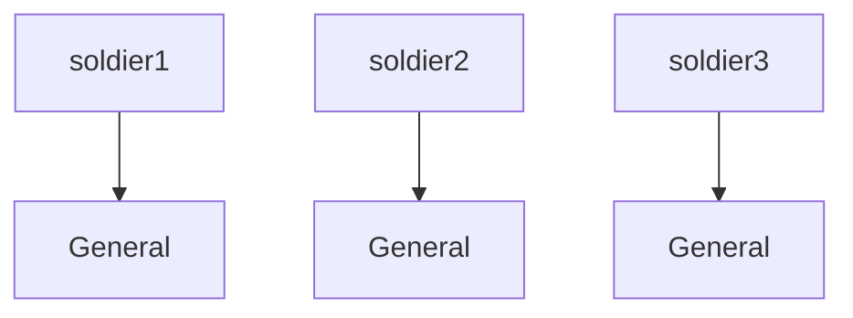
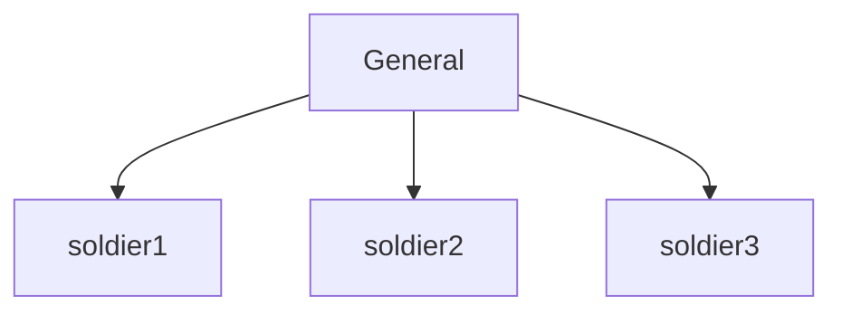
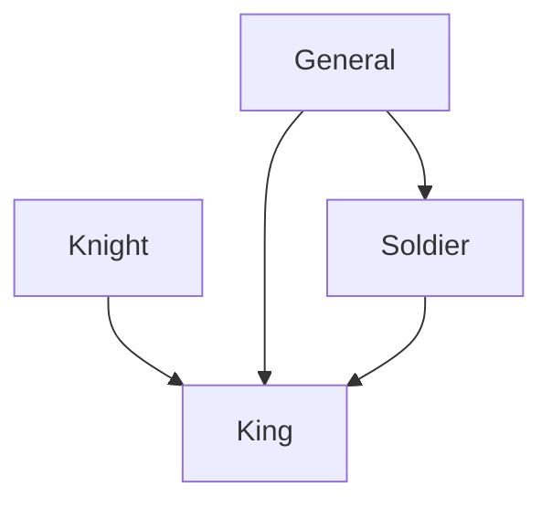

[OOP](https://developer.mozilla.org/en-US/docs/Learn/JavaScript/Objects/Object-oriented_programming) ეს არის **ო**ბიექტზე **ო**რიენტირებული **პ**როგრამირება.

## რა არის OOP

ობიექტზე ორიენტირებული პროგრამირება გულისხმობს, რომ აქცენტი კეთდება სრულიად ობიექტზე. წინა სტატიებში, როგორი სახითაც კოდს ვწერდით იყო პროცედურული პროგრამირება, სადაც ვქმნიდით პროცედურებს და ვიძახებით სხვადასხვა ადგილას.

OOP არის დიზაინის სისტემა სადაც:

- თითოეული ობიექტი წარმოადგენს ამ სისტემის რაღაც ასპექტს.
- ობიექტები შეიცავენ ფუნქციებსა და მონაცემებს.
- ობიექტები იძლევიან ინტერფეისებს რათა პროგრამის სხვადასხვა ნაწილებმა ისინი გამოიყენონ.
- მიუხედავად ამისა ობიექტები ინარჩუნებენ კერძო შინაგან მდგომარეობას.
- სისტემის სხვა ნაწილებისთვის აუცილებელი არ არის ამ ობიექტის შინაგან მდგომარეობაზე წვდომა.

OOP ძირითადად ეფუძვნება 3 პრინციპს:

1. [ინკაფსულაციას](#ინკაფსულაცია).
2. [მემკვიდრეობას](#მემკვიდრეობა).
3. [პოლიმორფიზს](#პოლიმორფიზი).

## კლასი

როცა სისტემას ვადგენთ OOP-ის მეშვეეობით, ჩვენ ვქმნით ობიექტების აბსტრაქტულ განსაზღვრებებს. ამას ეწოდება კლასი. კლასის მეშვეობით შეგვიძლია შევქმნათ ყალიბი, რომელსაც გამოვიყენებთ ხშირად.

```js
class Human {
  name;
  age;

  constructor(name, age) {
    this.name = name;
    this.age = age;
  }

  sayMyName() {
    console.log(this.name);
  }
}
```

ასე შევქმენით `Human` კლასი, სადაც გვაქვს ორი თვისება და ერთი მეთდი. კლასის შექმნა იწყება `class` ქივორდით, რომელსაც შემდგომ ვუწერთ სახელს. სტანდარტულად კარგია თუ სახელს დაიწყებთ, დიდი ასოთი და შეინარჩუნებთ [Pascal case](./doc/guides/javascript/variables#ცვლადის_სახელის_სტილი)-ს დასახელების სტილს.

კლასში არსებულ ფუნქციას ეწოდება მეთოდი. მეთოდების აღწერისას აღარ ვიყენებთ ქივორდ `function`-ს, ხოლო მისი სქოუპი არის არსებული ობიექტი, სადაც ის აღვწერეთ.

### კონსტრუქტორი

კლასი თავისთავად არაფერს აკეთებს, ის ერთგვარი მონახაზია, რომლითაც შეგვიძლია ამ კლასის სტრუქტურის მქონე მუშა ობიექტების შექმნა. ამ ობიექტებს ეწოდებათ კლასის **ინსტანციები**. კლასის ინსტანციას ქმნის განსაკუთრებული ფუნქცია **constructor**.

წინა მაგალითში კონსტრუქტორს მივაწოდეთ ორი პარამეტრი: `name` და `age`, რომელიც შემდგომ მივანიჭეთ კლასში არსებულს ცვლადებს.

:::info
Javascript-ში არ არის საჭირო, კლასის შექმნისას ყოველი ცვლადი წინასწარ იყოს აღწერილი თუმცა სხვა მკაცრად ტიპიზირებულ ენებში, აუცილებელია მისი თავიდანვე აღწერა. Javascript-ს შემთხვევაში შეგვეძლო არ დაგვეწერა `name` და `age` კონსტრუქტორამდე.
:::

ახალი ინსტანციის შესაქმნელად საჭიროა `new` ქივორდის გამოყენება:

```js
const human = new Human('ფრიდონი', 24);
console.log(human); // Human { name: 'ფრიდონი', age: 24 }
human.sayMyName(); // 'ფრიდონი'
```

ამრიგად შეგვიძლია იმდენი ობიექტი შექვმნათ რამდენიც გვსურს, მთავარია ახალი კლასის შექმნისას გამოვიყენოთ `new` ქივორდი, რაც მოგცემს ახალ ინსტანციას.

## ინკაფსულაცია

ობიექტების გამოყენებისას გვჭირდება ისეთი ტიპის თვისებების და მეთოდების შექმნა, რომელიც იქნება ღია ან დახურული. ინკაფსულაციით შეგვიძლია განვსაზღვროთ წვდომის შესაძლებლობა ყოველ თვისებაზე და მეთოდზე.

სულ გვაქვს 3 წვდომის შესაძლებლობა:

1. `public` - წვდომა შესაძლებელია ნებისმიერი ადგილიდან.
2. `private` - წვდომა მხოლოდ შესაძლებელია **არსებულ** კლასის შიგნიდან (კლასის სქოუფი).
3. `protected` - წვდომა შესაძლებელია მხოლოდ **არსებული** კლასის შიგნიდან და მისი მემკვიდრე კლასებიდან.

:::info
protected-ს გამოყენება javascript-ში არ შეგვიძლია თუმცა [typescript](./doc/guides/typescript/class#protected)-ში მისი გამოყენება თავისუფლად შესაძლებელია.
:::

მარტივი განსხვავებისთვის შეგიძლიათ წარმოიდგინოთ ეს მაგალითები:

- ტელეფონი, რომელსაც პაროლი **არ აქვს**.
- ტელეფონი, რომელსაც პაროლი აქვს მაგრამ **მხოლოდ** თქვენ იცით.
- ტელეფონი, რომელსაც პაროლი აქვს მაგრამ იცით **თქვენ** და თქვენთვის **ახლო** პიროვნებებმა.

```js
class User {
  constructor(name, email, password) {
    this.name = name;
    this.email = email;
    this.password = password;
  }

  login(email, password) {
    return this.email === email && this.password === password;
  }
}

const john = new User('John', 'john@doe.ge', '123456');
console.log(john.password); // 123456
console.log(john.login('john@doe.ge', '123456')); // true
console.log(john.login('john@doe.ge', '1234567')); // false
```

ამ შემთხვევაში ყოველი თვისება ღია წევრია, რაც გვაძლევს შესაძლებლობას, რომ მნიშვნელობა გამოვიძახოთ კლასის გარეთაც.

თუ გვსურს დახურული (private) თვისების შექმნა, მისი დეკლარაციისას უნდა გამოვიყენოთ `#`.

```js
class User {
  #password;
  constructor(name, email, password) {
    this.name = name;
    this.email = email;
    this.#password = password;
  }

  login(email, password) {
    return this.email === email && this.#password === password;
  }
}

const john = new User('John', 'john@doe.ge', '123456');
console.log(john.login('john@doe.ge', '123456')); // true
console.log(john.login('john@doe.ge', '1234567')); // false
console.log(john.password); // undefined
console.log(john.#password); // SyntaxError: Private field '#password' must be declared in an enclosing class
```

კლასის შიგნით ნებისმიერ ადგილას შეგვიძლია გამოვიყენოთ `#password` მაგრამ მისი კლასის გარეთ გამოყენების შემთხვევაში მივიღებთ სინტაქსურ შეცდომას: ` Private field '#password' must be declared in an enclosing class`.

## მემკვიდრეობა

მემკვიდრეობით შესაძლებელია ერთმა კლასმა მიიღოს მეორე კლასის სტრუქტურა. მემკვიდრე კლასს ვუწერთ `extends` ქივორდს იმ კლასის თანხლებით, რომელზეც ხდება "დაშენება".

```js
class Student {
  constructor(name, age, major) {
    this.name = name;
    this.age = age;
    this.major = major;
  }

  info() {
    console.log(`ჩემი სახელია ${this.name}, ვარ ${this.age} წლის და ვსწავლობ ${this.major}`);
  }
}

class Lecturer extends Student {
  constructor(name, age, major, subject) {
    super(name, age, major);
    this.subject = subject;
  }

  lecturerInfo() {
    console.log(`ჩემი სახელია ${this.name}, ვარ ${this.age} წლის, ვსწავლობდი ${this.major} და ვასწავლი ${this.subject}-ს`);
  }
}

const student = new Student('კონსტანტინე', 18, 'კომპიუტერულ მეცნიერებას');
student.info(); // ჩემი სახელია კონსტანტინე, ვარ 18 წლის და ვსწავლობ კომპიუტერულ მეცნიერებას

const lecturer = new Lecturer('გრიგოლი', 53, 'კომპიუტერულ მეცნიერებას', 'C++');
lecturer.info(); // ჩემი სახელია გრიგოლი, ვარ 53 წლის და ვსწავლობ კომპიუტერულ მეცნიერებას
lecturer.lecturerInfo(); // ჩემი სახელია გრიგოლი, ვარ 53 წლის, ვსწავლობდი კომპიუტერულ მეცნიერებას და ვასწავლი C++-ს
```

შევქმენით `Student`-ს კლასი, რომელსაც გააჩნია სამი თვისება და ერთი მეთოდი. სტუდენტის კლას დავაშენეთ `Lecturer`-ს კლასი, რომელმაც მიიღო სტუდენტის ყოველი თვისება და მეთოდი, ასევე დავუმატეთ ახალი თვისება და მეთოდი.

[`super`](https://developer.mozilla.org/en-US/docs/Web/JavaScript/Reference/Operators/super) ფუნქციით ინციალიზება გავუკეთეთ `Student`-ს კლასს, რაც გულისხმობს, მისი კონსტრუქტორის გამოძახებას სადაც გადაცემული პარამეტრები არის იგივე თანმიმდევრობით, რაც `Student`-ს კლასშია.

:::info
ამ შემთხვევაში "მშობელი" (Base class) კლასია `Student` ხოლო "შვილობილი" (Subclass) კლასია `Lecturer`.
:::

## პოლიმორფიზი

პოლიმორფიზმის საშუალებით შეგვიძლია შევცვალოთ მეთოდის გამოყენება შვილობილ კლასებში. წინა მაგალითს თუ დავუკვირდებით შეამჩნევთ, რომ მოგვიწია თითქმის იგივე ფუნქციის შექმნა შვილიბოლი კლასისთვის, რომ გაგვეშვა განსხვავებული ლოგი.

რეალურად შეგვეძლო პოლიმორფიზმით შეგვეცვლა შვილობილი კლასის ფუნქცია, რაც გვაძლევს უფრო სწორ შედეგს ვიდრე ახალი ფუნქცისი შემოტანა.

```js
class Student {
  constructor(name, age, major) {
    this.name = name;
    this.age = age;
    this.major = major;
  }

  info() {
    console.log(`ჩემი სახელია ${this.name}, ვარ ${this.age} წლის და ვსწავლობ ${this.major}`);
  }
}

class Lecturer extends Student {
  constructor(name, age, major, subject) {
    super(name, age, major);
    this.subject = subject;
  }

  info() {
    console.log(`ჩემი სახელია ${this.name}, ვარ ${this.age} წლის, ვსწავლობდი ${this.major} და ვასწავლი ${this.subject}-ს`);
  }
}

const student = new Student('კონსტანტინე', 18, 'კომპიუტერულ მეცნიერებას');
student.info(); // ჩემი სახელია კონსტანტინე, ვარ 18 წლის და ვსწავლობ კომპიუტერულ მეცნიერებას

const lecturer = new Lecturer('გრიგოლი', 53, 'კომპიუტერულ მეცნიერებას', 'C++');
lecturer.info(); // ჩემი სახელია გრიგოლი, ვარ 53 წლის, ვსწავლობდი კომპიუტერულ მეცნიერებას და ვასწავლი C++-ს
```

## მეთოდების Chaining

მეთოდების chaining ეს არის მიდგომა, როცა კლასში არსებული მეთოდი აბრუნებს საკუთარ ობიექტს. მსგავს ფუნქციონალს ხშირად წააწყდებით სხვადასხვა ობიეტებში.

მაგალითად:

```js
console.log([1, 2, 3, 4, 5].filter((number) => number % 2 === 0).reverse()); // [ 4, 2 ]
```

`filter` მეთოდმა დააბრუნა მასივი, იმავე მასივზე კი გამოვიყენეთ `reverse` მეთოდი.

იგივე ლოგიკა შეგვიძლია კლასებშიც შემოვიტანოთ, რომელიც უფრო გაამარტივებს მუშაობის პროცესს.

განვიხილოთ მაგალითი chaining-ს გარეშე:

```js
class HotDog {
  constructor(bread, meat, mayoneese, ketchup, mustard, pickles, onions) {
    this.bread = bread;
    this.meat = meat;
    this.mayoneese = mayoneese;
    this.ketchup = ketchup;
    this.mustard = mustard;
    this.pickles = pickles;
    this.onions = onions;
  }
}

const hotdog1 = new HotDog('სტანდარტული', 'სტანდარტული', true, true, false, true, false);
const hotdog2 = new HotDog('სტანდარტული', 'ვერსია 2', true, false, false, true, true);
```

ერთი შეხედვით რთულია იმის გაგება თუ რომელ პარამეტრს მიეკუთვნება `true` ან `false`.

თუ გამოვიყენებთ chaining-ს შედეგი უფრო წაკითხვადი იქნება:

```js
class HotDog {
  constructor(bread, meat, mayoneese, ketchup, mustard, pickles, onions) {
    this.bread = bread;
    this.meat = meat;
    this.mayoneese = false;
    this.ketchup = false;
    this.mustard = false;
    this.pickles = false;
    this.onions = false;
  }

  addMayoneese() {
    this.mayoneese = true;
    return this;
  }

  addKetchup() {
    this.ketchup = true;
    return this;
  }

  addMustard() {
    this.mustard = true;
    return this;
  }

  addPickles() {
    this.pickles = true;
    return this;
  }

  addOnions() {
    this.onions = true;
    return this;
  }
}

const hotdog1 = new HotDog('სტანდარტული', 'სტანდარტული').addKetchup().addMayoneese().addPickles();
const hotdog2 = new HotDog('სტანდარტული', 'ვერსია 2').addKetchup().addMustard().addOnions();
```

ასე გავიტანეთ მეთოდებში თითოეული თვისების დამატება. თითოეული თვისება აბრუნებს კლასის ინსტანციას `this`-ს გამოყენებით, რაც გვაძლევს chaining-ს საშუალებას, რაც საბოლოო ჯამში გვაძლევს უფრო უკეთეს კოდს.

## Dependency Injection

DI არის დიზაინის პატერნი სადაც ობიექტი, კლასი თუ ფუნქცია
იღებს იმ ობიექტებსა და ფუნქციებს რომლებზეც ის დამოკიდებულია. ასე კოდის ორგანიზება
შეგვიძლია მათი მოვალეობების მიხედვით, სადაც კონკრეტული ფუნქცია, კლასი თუ ობიექტი
ერთ დანიშნულებას ემსახურება. თუ ეს დანიშნულება რაიმე სხვა კლასს სჭირდება, იგი მასზე
დამოკიდებულებას გამოაცხადებს.

სანიმუშოდ განვიხილოთ შემდეგი კლასები:

```js
class Knight {
  defend() {
    return 'defend the ruler';
  }
}

class General {
  command() {
    return 'give commands';
  }
}
```

წარმოვიდგინოთ რომ ეს კლასები კონკრეტულ დანიშნულებას ასრულებენ დამოუკიდებლად.
ახლა ვთქვათ, რომ გვაქვს ერთი `Soldier` კლასი, რომელსაც სრულფასოვნად ფუნქციონირებისთვის
`General` კლასის ინსტანცია სჭირდება. `General` კლასის გამოყენების ერთი ვარიანტი
იქნებოდა ასეთი:

```js
class Soldier {
  orders = 'no orders for now';
  constructor() {
    this.general = new General();
    this.orders = this.general.command();
  }
}
```

ასეთ კოდში მკაფიოდ არ ჩანს, რომ `Soldier` კლასს სჭირდება `General`. ეს მიტუმეტეს გაუგებარი
იქნებოდა, თუ თითოეული კლასი ცალკეულ დიდ და კომპლექსურ ფაილში გვექნებოდა. როცა
ჩვენ `Soldier` კლასის ინსტანციას შევქმნიდით, არავის ეცოდინებოდა, რომ ამ კლასს სჭირდებოდა
`General` კლასი. მისი ინსტანცია შეიქმნება, მაგრამ ეს უკანა ფონზე, ჩუმად მოხდება.

```js
const soldier1 = new Soldier();
const soldier2 = new Soldier();
const soldier3 = new Soldier();
```



აქ თითოეული `Soldier`-ის ინსტანციას ცალკეული `General`-ის ინსტანცია გააჩნია.
რაც უფრო მეტია `Soldier`, მით უფრო მეტ `General`-ს შექმნის ის.

ამიტომაც კონსოლში ეს დაგვიბრუნებს false-ს.

```js
console.log(soldier1.general === soldier2.general);
```

ამის გასაკეთებლად უკეთესი და უფრო დეკლარაციული გზა იქნებოდა შემდეგნაირი:

```ts
class Soldier {
  orders = 'no orders for now';
  constructor(general) {
    this.general = general;
    this.orders = this.general.command();
  }
}
```

ჩვენ კონსტრუქტორში მივუთითებთ, რომ `Soldier` დამოკიდებულია General ტიპის ობიექტზე.
ახლა განსხვავება ის არის, რომ `Soldier` კლასის შექმნისას ჩვენ მას აუცილებლად უნდა
მივაწოდოთ `General`-ის ინსტანცია, იმის მაგივრად, რომ `Soldier`-მა ეს თავისით, ფარულად ქნას:

```js
const general = new General();
const soldier1 = new Soldier(general);
const soldier2 = new Soldier(general);
const soldier3 = new Soldier(general);
```



ერთი მხრივ, ახლა მკაფიოა, რომ `Soldier`-ს სჭირდება `General`, მაგრამ მეორე მხრივ,
ყოველ `Soldier`-ს ერთი და იგივე `General`-ის ინსტანცია აქვს. ასე ვთქვათ, ამ ჯარისკაცებს
ერთი გენერალი მართავს, რომლის ინსტანციაც ჩვენ თავდაპირველად შევქმენით, და თითოეულ
ჯარისკაცს მივაწოდეთ კონსტრუქტორში. ეს ასევე ბეფრად უფრო ეკონომიურია, რადგან ტყუილად
არ ვქმნით იმდენივე `General`-ის ინსტანციას, რამდენი `Soldier`-იც დაგვჭირდება.

ახლა ეს შედეგად მოგვცემს true-ს.

```js
console.log(soldier1.general === soldier2.general);
```

ეს არის Dependency Injection-ის მარტივი მაგალითი. კლასი აცხადებს, თუ რაზეა ის დამოკიდებული,
ანუ აცხადებს თავის dependency-ს, რომელსაც შემდგომ ინსტანციის შექმნისას იღებს.

ახლა ასპარეზზე შემოვიყვანოთ მეფე: `King` კლასი, რომელიც საჭიროებს ყველა შემდეგ კლასს:
`Knight`, `Soldier`, `General`.

```js
class King {
  constructor(knight, general, soldier) {
    this.knight = knight;
    this.general = general;
    this.soldier = soldier;
  }
}
```

მაშინ ამ კლასის ინსტანციის შესაქმნელად ჩვენ შემდეგნაირად უნდა მოვიქცეთ:

```js
const knight = new Knight();
const general = new General();
const soldier = new Soldier(general);
const king = new King(knight, general, soldier);
```



ჯერ დამოუკიდებელ `Knight` და `General` კლასებს ვქმნით, ხოლო შემდგომ
`Soldier` კლასს, რომელსაც `General`-ის ინსტანცია სჭირდება. შემდგომ ვქმნით
`King`-ის ინსტანციას, რომელსაც სამივე სჭირდება. აქ აღსანიშნავია, რომ `soldier`-სა
და `king`-ს ერთი და იგივე `General`-ის ინსტანცია გააჩნიათ: `general`.
ასე კლასების ურთიერთდამოკიდებულება უფრო მკაფიო და გასაგებია. დეკლარაციული
კოდის პლიუსი სწორედ ეს არის.

რაც უფრო მეტი კლასი გვიგროვდება, ამ dependency-ების მენეჯმენტი და ახალი კლასის ინსტანციების
შექმნა უფრო გართულდება. სწორედ ამიტომ არსებობს **DI კონტეინერი**, რომელიც ამ
ყველაფერს ჩვენ მაგივრად აგვარებს. ჩვენ კონსტრუქტორში უბრალოდ ის უნდა გამოვაცხადოთ, თუ რაზე
არის დამოკიდებული ჩვენი კლასი და დანარჩენს DI კონტეინერი მოაგვარებს.

DI კონტეინერის ბევრი ბიბლიოთეკა/ფრეიმვორკი არსებობს, ბევრ ბიბლიოთეკა/ფრეიმვორკსაც კი საერთდ ჩაშენებული აქვს. მაგალითისთვის ანგულარში პირდაპრი ჩაშენებული არის _DI კონტეინერი_.

ჩვენითაც შეგვიძლია შევქმნათ DI კონტეინერი:

```js
class DIContainer {
  constructor() {
    this.services = {};
  }

  register(name, definition, dependencies = []) {
    this.services[name] = { definition, dependencies };
  }

  get(name) {
    const service = this.services[name];

    if (!service) {
      throw new Error(`Service ${name} not found`);
    }

    if (!service.instance) {
      const dependencies = service.dependencies.map((dep) => this.get(dep));
      service.instance = new service.definition(...dependencies);
    }

    return service.instance;
  }
}

class Knight {}
class General {}
class Soldier {
  constructor(general) {
    this.general = general;
  }
}
class King {
  constructor(knight, general, soldier) {
    this.knight = knight;
    this.general = general;
    this.soldier = soldier;
  }
}

const container = new DIContainer();
container.register('knight', Knight);
container.register('general', General);
container.register('soldier', Soldier, ['general']);
container.register('king', King, ['knight', 'general', 'soldier']);

const king = container.get('king');
console.log(king);
```

ამ კოდით ვღებულობთ მცირედ იმიტაციას DI კონტეინერების თუმცა რეალურ პროექტში საჭიროა უფრო მეტი ფუნქციონალური ნაწილი, როგორიცა: ავტომატურად დარეგისტრირება (inject), ქეშირება, lifecycle მენეჯმენტი, კონფიგურირება და სხვა.

## შეჯამება

ამ სტატიაში განვიხილეთ თუ რა არის OOP, რომელ ძირითად პრინციპებს ეყრდონბა OOP, როგორი აქსეს მოდიფაიერები გააჩნია კლასს, რა არის კონსტრუქტორი, როგორ გამოვიყენოთ chaining და რა არის DI. OOP-ს გამოყენებით შეგიძლიათ თავი აარიდოთ მსგასვი ობიექტების ხელახლა შექმნას.
