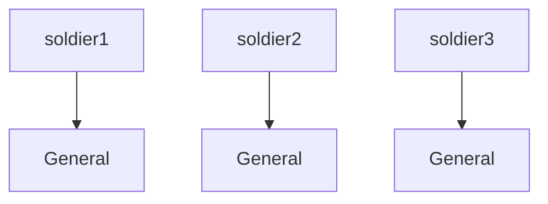
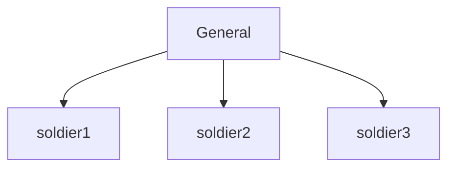
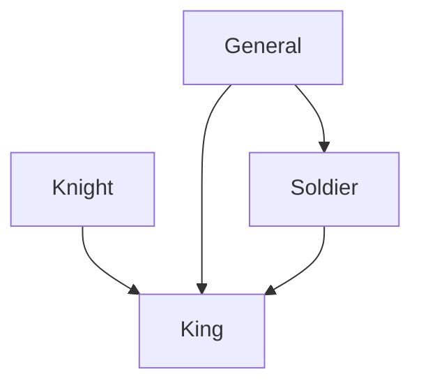

## რა არის OOP

ობიექტზე ორიენტირებული პროგრამირება, - იგივე [OOP](https://developer.mozilla.org/en-US/docs/Learn/JavaScript/Objects/Object-oriented_programming) -
გულისხმობს პროგრამირების პარადიგმას ან დიზაინის სისტემას, სადაც კოდი იწერება ობიექტების აღწერით.

OOP არის დიზაინის სისტემა სადაც:

- თითოეული ობიექტი წარმოადგენს ამ სისტემის რაღაც ასპექტს.
- ობიექტები შეიცავენ ფუნქციებსა და მონაცემებს.
- ობიექტები იძლევიან ინტერფეისებს რათა პროგრამის სხვადასხვა ნაწილებმა ისინი გამოიყენონ.
- მიუხედავად ამისა ობიექტები ინარჩუნებენ კერძო შინაგან მდგომარეობას.
- სისტემის სხვა ნაწილებისთვის აუცილებელი არ არის ამ ობიექტის შინაგან მდგომარეობაზე წვდომა.

OOP ძირითადად ეფუძნება 3 პრინციპს:

1. [ინკაფსულაციას](#ინკაფსულაცია).
2. [მემკვიდრეობას](#მემკვიდრეობა).
3. [პოლიმორფიზმს](#პოლიმორფიზმი).

## კლასი

როცა სისტემას ვადგენთ OOP-ის მეშვეეობით, ჩვენ ვქმნით ობიექტების აბსტრაქტულ განსაზღვრებებს. ამას ეწოდება კლასი.
კლასის მეშვეობით შეგვიძლია შევქმნათ ყალიბი, რომელსაც ერთგან განვსაზღვრავთ და ბევრგან გამოვიყენებთ.

```js
class Human {
  name; // თვისება
  age;

  constructor(name, age) {
    this.name = name;
    this.age = age;
  }

  // მეთოდი
  sayMyName() {
    console.log(this.name);
  }
}
```

ასე შევქმენით `Human` კლასი, სადაც გვაქვს ორი თვისება და ერთი მეთდი. კლასის შექმნა იწყება `class` ქივორდით, რომელსაც შემდგომ ვუწერთ სახელს.
კონვენციურად კლასის სახელები იწერება [Pascal case](./doc/guides/javascript/variables#ცვლადის_სახელის_სტილი)-ში.

კლასში არსებულ ფუნქციას ეწოდება მეთოდი. მეთოდების აღწერისას აღარ ვიყენებთ ქივორდ `function`-ს, ხოლო მისი სქოუპი არის არსებული ობიექტი, სადაც ის აღვწერეთ.

### კონსტრუქტორი

კლასი თავისთავად არაფერს აკეთებს, ის ერთგვარი მონახაზია, რომლითაც შეგვიძლია ამ კლასის სტრუქტურის მქონე მუშა ობიექტების შექმნა.
ამ ობიექტებს ეწოდებათ კლასის **ინსტანციები**. კლასის ინსტანციას ქმნის განსაკუთრებული ფუნქცია **constructor**.

წინა მაგალითში კონსტრუქტორში განსვსაზღვრეთ ორი პარამეტრი: `name` და `age`, რომლებიც შემდგომ მივანიჭეთ კლასში არსებულ თვისებებს.

:::info
Javascript-ში არ არის საჭირო, კლასის შექმნისას ყოველი თვისება წინასწარ იყოს დეკლარირებული, თუმცა სხვა მკაცრად ტიპიზირებულ ენებში აუცილებელია მისი თავიდანვე აღწერა.
Javascript-ის შემთხვევაში შეგვეძლო არ დაგვეწერა `name` და `age` კონსტრუქტორამდე.
:::

ახალი ინსტანციის შესაქმნელად საჭიროა `new` ქივორდის გამოყენება:

```js
const human = new Human('ფრიდონი', 24);
console.log(human); // Human { name: 'ფრიდონი', age: 24 }
human.sayMyName(); // 'ფრიდონი'
```

`new` ოპერატორი შექმნის ახალი ობიექტის ინსტანციას, ხოლო კლასზე ფუნქციასავით დაძახებით, ჩვენ ვააქტიურებთ მის კონსტრუქტორს,
რომელიც ახალ ობიექტს ჩვენ მიერ განსაზღვრულ თვისებებს მიანიჭებს.
ამრიგად შეგვიძლია იმდენი ობიექტი შექვმნათ რამდენიც გვსურს.

## ინკაფსულაცია

ობიექტების გამოყენებისას გვჭირდება ისეთი ტიპის თვისებების და მეთოდების შექმნა, რომელიც იქნება ღია ან დახურული.
ინკაფსულაციით შეგვიძლია განვსაზღვროთ წვდომის შესაძლებლობა ყოველ თვისებასა და მეთოდზე.

სულ გვაქვს 3 წვდომის ვარიანტი:

1. `public` - წვდომა შესაძლებელია ნებისმიერი ადგილიდან.
2. `private` - წვდომა მხოლოდ შესაძლებელია **არსებულ** კლასის შიგნიდან (კლასის სქოუფი).
3. `protected` - წვდომა შესაძლებელია მხოლოდ **არსებული** კლასის შიგნიდან და მისი მემკვიდრე კლასებიდან.

:::info
protected-ის გამოყენება javascript-ში არ შეგვიძლია, თუმცა [TypeScript](./doc/guides/typescript/class#protected)-ში ამის საშუალება გვაქვს.
:::

მარტივი განსხვავებისთვის შეგიძლიათ წარმოიდგინოთ ეს მაგალითები:

- ტელეფონი, რომელსაც პაროლი **არ აქვს**.
- ტელეფონი, რომელსაც პაროლი აქვს მაგრამ **მხოლოდ** თქვენ იცით.
- ტელეფონი, რომელსაც პაროლი აქვს მაგრამ იცით **თქვენ** და თქვენთვის **ახლო** პიროვნებებმა.

```js
class User {
  constructor(name, email, password) {
    this.name = name;
    this.email = email;
    this.password = password;
  }

  login(email, password) {
    return this.email === email && this.password === password;
  }
}

const john = new User('John', 'john@doe.ge', '123456');
console.log(john.password); // 123456
console.log(john.login('john@doe.ge', '123456')); // true
console.log(john.login('john@doe.ge', '1234567')); // false
```

ამ შემთხვევაში ყოველი თვისება ღია წევრია, რაც გვაძლევს შესაძლებლობას, რომ მნიშვნელობა წავიკითხოთ და შევცვალოთ კლასის გარეთაც.

თუ გვსურს დახურული (private) თვისების შექმნა, მისი დეკლარაციისას უნდა გამოვიყენოთ `#`.

```js
class User {
  #password;
  constructor(name, email, password) {
    this.name = name;
    this.email = email;
    this.#password = password;
  }

  login(email, password) {
    return this.email === email && this.#password === password;
  }
}

const john = new User('John', 'john@doe.ge', '123456');
console.log(john.login('john@doe.ge', '123456')); // true
console.log(john.login('john@doe.ge', '1234567')); // false
console.log(john.password); // undefined
console.log(john.#password); // SyntaxError: Private field '#password' must be declared in an enclosing class
```

კლასის შიგნით ნებისმიერ ადგილას შეგვიძლია გამოვიყენოთ `#password`, მაგრამ მისი კლასის გარეთ გამოყენების შემთხვევაში მივიღებთ სინტაქსურ შეცდომას: ` Private field '#password' must be declared in an enclosing class`.

აქ პაროლი პირობითი მაგალითია და არ ემსახურება მომხმარებლის მონაცემების დაცვას.
ინკაფსულაცია საჭიროა უსფართხოდ პროგრამირებისთვის, როცა ერთმანეთისგან გვინდა განვაცალკევოთ ობიექტის ღია და დახურული თვისებები.
ზოგი თვისება ობიექტის გარედან არ უნდა შეიცვალოს, რათა არ მოხდეს გაუთვლელი შეცდომები, ან მათი შეცვლა უნდა შეიძლებოდეს მხოლოდ ღია მეთოდებით,
სადაც დეველოპერს წინასწარ აქვს გათვლილი შიდა მდგომარეობის ცვლილება.

## მემკვიდრეობა

მემკვიდრეობით შესაძლებელია ერთმა კლასმა მიიღოს მეორე კლასის სტრუქტურა.
ეს მაშინ გვჭირდება, როცა კლასებს საზიარო თვისებები და მეთოდები გააჩნია.
მაგალითად გვინდა შევქმნათ სტუდენტისა და ლექტორის კლასი, რადგან ყველა თვისება, რომელიც ახასიათებს სტუდენტს, გააჩნია ლექტორსაც,
თუმცა ლექტორს სხვა დამატებითი თვისებებიც აქვს.
მაშინ გვინდა, რომ ჯერ შევქმნათ სტუდენტის კლასი და მასზე დავაშენოთ ლექტორის კლასი.

მემკვიდრე კლასს ეწოდება **ქვეკლასი (subclass)**, ხოლო იმ კლასს, რომლისგანაც იგი მემკვიდრეობას იღებს - **სუპერკლასი (superclass)**.
მაშასადამე, სუპერკლასია სტუდენტი, ხოლო ქვეკლასი - ლექტორი.

მემკვიდრე კლასს ვუწერთ `extends` ქივორდს იმ კლასის თანხლებით, რომელზეც ხდება "დაშენება".

```js
class Student {
  constructor(name, age, major) {
    this.name = name;
    this.age = age;
    this.major = major;
  }

  info() {
    console.log(`ჩემი სახელია ${this.name}, ვარ ${this.age} წლის და ვსწავლობ ${this.major}`);
  }
}

class Lecturer extends Student {
  constructor(name, age, major, subject) {
    super(name, age, major);
    this.subject = subject;
  }

  lecturerInfo() {
    console.log(`ჩემი სახელია ${this.name}, ვარ ${this.age} წლის, ვსწავლობდი ${this.major} და ვასწავლი ${this.subject}-ს`);
  }
}

const student = new Student('კონსტანტინე', 18, 'კომპიუტერულ მეცნიერებას');
student.info(); // ჩემი სახელია კონსტანტინე, ვარ 18 წლის და ვსწავლობ კომპიუტერულ მეცნიერებას

const lecturer = new Lecturer('გრიგოლი', 53, 'კომპიუტერულ მეცნიერებას', 'C++');
lecturer.info(); // ჩემი სახელია გრიგოლი, ვარ 53 წლის და ვსწავლობ კომპიუტერულ მეცნიერებას
lecturer.lecturerInfo(); // ჩემი სახელია გრიგოლი, ვარ 53 წლის, ვსწავლობდი კომპიუტერულ მეცნიერებას და ვასწავლი C++-ს
```

შევქმენით `Student`-ის კლასი, რომელსაც გააჩნია სამი თვისება და ერთი მეთოდი. სტუდენტის კლასზე დავაშენეთ `Lecturer`-ის კლასი,
რომელმაც მიიღო სტუდენტის ყოველი თვისება და მეთოდი, თუმცა მას ასევე დავუმატეთ ახალი თვისება `subject` და მეთოდი `lecturerInfo`.

[`super`](https://developer.mozilla.org/en-US/docs/Web/JavaScript/Reference/Operators/super) ფუნქციით დავუძახეთ სუპერკლასის, ანუ `Student`-ის კონსტრუქტორს
და გადავეცით სტუდენტისთვის საჭირო პარამეტრები (რომლებიც, `subject`-ის გარდა, ლექტორის კონსტრუქტორის პარამეტრებშიც შევქმენით).

## პოლიმორფიზმი

პოლიმორფიზმის საშუალებით შეგვიძლია შევცვალოთ მეთოდის გამოყენება შვილობილ კლასებში. წინა მაგალითს თუ დაუკვირდებით შეამჩნევთ,
რომ მოგვიწია თითქმის იგივე ფუნქციის შექმნა შვილიბოლი კლასისთვის, რათA გაგვეშვა განსხვავებული ლოგი.

რეალურად, შეგვეძლო პოლიმორფიზმით შეგვეცვლა შვილობილი კლასის ფუნქცია, რაც გვაძლევს უფრო ლოგიკურად გამართულ იმპლემენტაციას, ვიდრე ახალი ფუნქცისი შემოტანა.

```js
class Student {
  constructor(name, age, major) {
    this.name = name;
    this.age = age;
    this.major = major;
  }

  info() {
    console.log(`ჩემი სახელია ${this.name}, ვარ ${this.age} წლის და ვსწავლობ ${this.major}`);
  }
}

class Lecturer extends Student {
  constructor(name, age, major, subject) {
    super(name, age, major);
    this.subject = subject;
  }

  info() {
    console.log(`ჩემი სახელია ${this.name}, ვარ ${this.age} წლის, ვსწავლობდი ${this.major} და ვასწავლი ${this.subject}-ს`);
  }
}

const student = new Student('კონსტანტინე', 18, 'კომპიუტერულ მეცნიერებას');
student.info(); // ჩემი სახელია კონსტანტინე, ვარ 18 წლის და ვსწავლობ კომპიუტერულ მეცნიერებას

const lecturer = new Lecturer('გრიგოლი', 53, 'კომპიუტერულ მეცნიერებას', 'C++');
lecturer.info(); // ჩემი სახელია გრიგოლი, ვარ 53 წლის, ვსწავლობდი კომპიუტერულ მეცნიერებას და ვასწავლი C++-ს
```

ასე `Lecturer` კლასი override-ს უკეთებს `Student`-ის `info` მეთოდს.

## მეთოდების Chaining

მეთოდების chaining არის მიდგომა, როცა კლასში არსებული მეთოდი აბრუნებს საკუთარ ობიექტს. მსგავს ფუნქციონალს ხშირად წააწყდებით სხვადასხვა ობიეტებში.

მაგალითად:

```js
console.log([1, 2, 3, 4, 5].filter((number) => number % 2 === 0).reverse()); // [ 4, 2 ]
```

`filter` მეთოდმა დააბრუნა მასივი, იმავე მასივზე კი გამოვიყენეთ `reverse` მეთოდი.

იგივე ლოგიკა შეგვიძლია კლასებშიც შემოვიტანოთ, რაც უფრო გაამარტივებს მასთან მუშაობის პროცესს.

განვიხილოთ მაგალითი chaining-ს გარეშე:

```js
class HotDog {
  constructor(bread, meat, mayoneese, ketchup, mustard, pickles, onions) {
    this.bread = bread;
    this.meat = meat;
    this.mayoneese = mayoneese;
    this.ketchup = ketchup;
    this.mustard = mustard;
    this.pickles = pickles;
    this.onions = onions;
  }
}

const hotdog1 = new HotDog('სტანდარტული', 'სტანდარტული', true, true, false, true, false);
const hotdog2 = new HotDog('სტანდარტული', 'ვერსია 2', true, false, false, true, true);
```

ერთი შეხედვით რთულია იმის გაგება, თუ რომელ პარამეტრს მიეკუთვნება `true` ან `false`.

თუ გამოვიყენებთ chaining-ს, შედეგი უფრო წაკითხვადი იქნება:

```js
class HotDog {
  constructor(bread, meat, mayoneese, ketchup, mustard, pickles, onions) {
    this.bread = bread;
    this.meat = meat;
    this.mayoneese = false;
    this.ketchup = false;
    this.mustard = false;
    this.pickles = false;
    this.onions = false;
  }

  addMayoneese() {
    this.mayoneese = true;
    return this;
  }

  addKetchup() {
    this.ketchup = true;
    return this;
  }

  addMustard() {
    this.mustard = true;
    return this;
  }

  addPickles() {
    this.pickles = true;
    return this;
  }

  addOnions() {
    this.onions = true;
    return this;
  }
}

const hotdog1 = new HotDog('სტანდარტული', 'სტანდარტული').addKetchup().addMayoneese().addPickles();
const hotdog2 = new HotDog('სტანდარტული', 'ვერსია 2').addKetchup().addMustard().addOnions();
```

ასე გავიტანეთ მეთოდებში თითოეული თვისების დამატება. თითოეული თვისება აბრუნებს კლასის ინსტანციას `this`-ის გამოყენებით,
რაც გვაძლევს chaining-ის საშუალებას.

## static

ყოველთვის არ არის საჭირო ახალი ინსტანციის გამოყოფა, ზოგჯერ შესაძლებელია დაგვჭირდეს ისეთი ტიპის კლასი, სადაც მასში არსებული მეთოდები იქნება
სრულიად **სტატიკური**. გაიხსენეთ `Math` ან `Object` ობიექტები, რომლებიც ერთგვარი კლასებია: ჩვენ მათი მეთოდების გამოსაყენებლად არ გვჭირდება ინსტანციის შექმნა.

მაგალითისთვის შევქმნათ ჩვენი მათემატიკური კლასი, სადაც იქნება რამდენიმე საინტერესო მეთოდი:

```js
class MathUtils {
  static fibonacci(n) {
    if (n < 0) {
      return NaN;
    }
    if (n === 0) {
      return 0;
    }
    if (n === 1) {
      return 1;
    }
    return MathUtils.fibonacci(n - 1) + MathUtils.fibonacci(n - 2);
  }

  static factorial(n) {
    if (n < 1) {
      return NaN;
    }
    return n === 0 || n === 1 ? 1 : n * MathUtils.factorial(n - 1);
  }

  static distanceBetweenCordinates(x1, y1, x2, y2) {
    const dx = x2 - x1;
    const dy = y2 - y1;
    return Math.sqrt(dx * dx + dy * dy);
  }

  static discriminant(a, b, c) {
    const d = b * b - 4 * a * c;
    const re = -b * 2 * a;
    const im = Math.sqrt(Math.abs(d)) / (2 * a);

    if (d > 0) {
      return [re + im, re - im];
    } else if (d === 0) {
      return [re, re];
    } else {
      return [`${re} + ${im} * i`, `${re} - ${im} * i`];
    }
  }
}
console.log(`ფიბონაჩს მეათე მიმდევრობა არის: ${MathUtils.fibonacci(10)}`); // ფიბონაჩს მეათე მიმდევრობა არის: 55
console.log(`ფაქტორიალი ათისა არის: ${MathUtils.factorial(10)}`); // ფაქტორიალი ათისა არის: 3628800
console.log(`(5, 1)-სა და (10, 3)-ს შორის მანძილი არის: ${MathUtils.distanceBetweenCordinates(5, 1, 10, 3)}`); // (5, 1)-სა და (10, 3)-ს შორის მანძილი არის: 5.385164807134504
console.log(`ფესვები კვადრატული განტოლების 2x^2 - 10x + 2 = 0: ${MathUtils.discriminant(2, 10, 2)}`); // ფესვები კვადრატული განტოლების 2x^2 - 10x + 2 = 0: -37.70871215252208,-42.29128784747792
```

ამრიგად არ მოგვიწია ახალი ინსტანციის გამოყოფა და გამოვიყენეთ ყოველი სტატიკური მეთოდი.
სტატიკური მეთოდები ხელსაყრელია, როცა გვინდა სხვადასხვა ფუნქციებისა თუ თვისებების გაერთიანება ერთი სახელის ქვეშ.

## Dependency Injection

Dependency Injection, იგივე DI, არის OOP-ში დამკვიდრებული დიზაინის პატერნი სადაც ობიექტი, კლასი თუ ფუნქცია
იღებს იმ ობიექტებსა და ფუნქციებს რომლებზეც ის დამოკიდებულია. ასე კოდის ორგანიზება
შეგვიძლია მათი მოვალეობების მიხედვით, სადაც კონკრეტული ფუნქცია, კლასი თუ ობიექტი
ერთ დანიშნულებას ემსახურება. თუ ეს დანიშნულება რაიმე სხვა კლასს სჭირდება, იგი მასზე
დამოკიდებულებას გამოაცხადებს.

ამ პატერნის მთავარი სარგებელი არის **აბსტრაქტულობა**.
ჩვენ ზოგადად განვსაზღვრავთ ობიექტების ერთგვარ "ყალიბებს", რომლებიც ცალ-ცალკე აღწერენ რა ტიპის ობიექტები სჭირდებათ, რომ სწორად იმუშაონ.
შემდგომ შესაძლებელი ხდება ამ ობიექტების მათთვის მიწოდება (ან ჩანაცვლება) სხვადასხვა გზით.

სანიმუშოდ განვიხილოთ შემდეგი კლასები:

```js
class Knight {
  defend() {
    return 'defend the ruler';
  }
}

class General {
  command() {
    return 'give commands';
  }
}
```

წარმოვიდგინოთ რომ ეს კლასები კონკრეტულ დანიშნულებას ასრულებენ დამოუკიდებლად.
ახლა ვთქვათ, რომ გვაქვს ერთი `Soldier` კლასი, რომელსაც სრულფასოვნად ფუნქციონირებისთვის
`General` კლასის ინსტანცია სჭირდება. `General` კლასის გამოყენების ერთი ვარიანტი
იქნებოდა ასეთი:

```js
class Soldier {
  orders = 'no orders for now';
  constructor() {
    this.general = new General();
    this.orders = this.general.command();
  }
}
```

ასეთ კოდში მკაფიოდ არ ჩანს, რომ `Soldier` კლასს სჭირდება `General`. ეს მითუმეტეს გაუგებარი
იქნებოდა, თუ თითოეული კლასი ცალკეულ დიდ და კომპლექსურ ფაილში გვექნებოდა. როცა
ჩვენ `Soldier` კლასის ინსტანციას შევქმნიდით, არავის ეცოდინებოდა, რომ ამ კლასს სჭირდებოდა
`General` კლასი. მისი ინსტანცია შეიქმნება, მაგრამ ეს უკანა ფონზე, ჩუმად მოხდება.

```js
const soldier1 = new Soldier();
const soldier2 = new Soldier();
const soldier3 = new Soldier();
```



აქ თითოეული `Soldier`-ის ინსტანციას ცალკეული `General`-ის ინსტანცია გააჩნია.
რაც უფრო მეტია `Soldier`, მით უფრო მეტ `General`-ს შექმნის ის.

ამიტომაც კონსოლში ეს დაგვიბრუნებს false-ს.

```js
console.log(soldier1.general === soldier2.general);
```

ამის გასაკეთებლად უკეთესი და უფრო აბსტრაქტული გზა იქნებოდა შემდეგნაირი:

```ts
class Soldier {
  orders = 'no orders for now';
  constructor(general) {
    this.general = general;
    this.orders = this.general.command();
  }
}
```

ჩვენ კონსტრუქტორში მივუთითებთ, რომ `Soldier` დამოკიდებულია General ტიპის ობიექტზე.
ახლა განსხვავება ის არის, რომ `Soldier` კლასის შექმნისას ჩვენ მას აუცილებლად უნდა
მივაწოდოთ `General`-ის ინსტანცია, იმის მაგივრად, რომ `Soldier`-მა ეს თავისით, ფარულად ქნას:

```js
const general = new General();
const soldier1 = new Soldier(general);
const soldier2 = new Soldier(general);
const soldier3 = new Soldier(general);
```



ერთი მხრივ, ახლა მკაფიოა, რომ `Soldier`-ს სჭირდება `General`, მაგრამ მეორე მხრივ,
ყოველ `Soldier`-ს ერთი და იგივე `General`-ის ინსტანცია აქვს. ასე ვთქვათ, ამ ჯარისკაცებს
ერთი გენერალი მართავს, რომლის ინსტანციაც ჩვენ თავდაპირველად შევქმენით, და თითოეულ
ჯარისკაცს მივაწოდეთ კონსტრუქტორში. ეს ასევე ბეფრად უფრო ეკონომიურია, რადგან ტყუილად
არ ვქმნით იმდენივე `General`-ის ინსტანციას, რამდენი `Soldier`-იც დაგვჭირდება.

ახლა ეს შედეგად მოგვცემს true-ს.

```js
console.log(soldier1.general === soldier2.general);
```

გარდა ამისა, ახლა შეგვიძლია თითოეულ ჯარისკაცს ის გენერალი მივუჩინოთ, რომელიც ჩვენ გაგვიხარდება,
მაგალითად შევქმნათ 3 გენერალი, რომლებსაც თავიანთი ბატალიონები ეყოლებათ:

```js
const general1 = new General();
const general2 = new General();
const general3 = new General();

// 1-ლი ბატალიონი
const soldier1 = new Soldier(general1);
const soldier2 = new Soldier(general1);

// მე-2 ბატალიონი
const soldier3 = new Soldier(general2);
const soldier4 = new Soldier(general2);

// მე-3 ბატალიონი
const soldier5 = new Soldier(general3);
const soldier6 = new Soldier(general3);
```

ეს არის Dependency Injection-ის მარტივი მაგალითი. კლასი აცხადებს, თუ რაზეა ის დამოკიდებული,
ანუ აცხადებს თავის dependency-ს, რომელსაც შემდგომ ინსტანციის შექმნისას იღებს.

ახლა ასპარეზზე შემოვიყვანოთ მეფე: `King` კლასი, რომელიც საჭიროებს ყველა შემდეგ კლასს:
`Knight`, `Soldier`, `General`.

```js
class King {
  constructor(knight, general, soldier) {
    this.knight = knight;
    this.general = general;
    this.soldier = soldier;
  }
}
```

მაშინ ამ კლასის ინსტანციის შესაქმნელად ჩვენ შემდეგნაირად უნდა მოვიქცეთ:

```js
const knight = new Knight();
const general = new General();
const soldier = new Soldier(general);
const king = new King(knight, general, soldier);
```



ჯერ დამოუკიდებელ `Knight` და `General` კლასებს ვქმნით, ხოლო შემდგომ
`Soldier` კლასს, რომელსაც `General`-ის ინსტანცია სჭირდება. შემდგომ ვქმნით
`King`-ის ინსტანციას, რომელსაც სამივე სჭირდება. აქ აღსანიშნავია, რომ `soldier`-სა
და `king`-ს ერთი და იგივე `General`-ის ინსტანცია გააჩნიათ: `general`.
ასე კლასების ურთიერთდამოკიდებულება უფრო მკაფიო და გასაგებია.

რაც უფრო მეტი კლასი გვიგროვდება, ამ dependency-ების მენეჯმენტი და ახალი კლასის ინსტანციების
შექმნა უფრო გართულდება. სწორედ ამიტომ ზოგიერთ სისტემებში გვხვდება ე.წ **DI კონტეინერი**, რომელიც ამ
ყველაფერს ჩვენ მაგივრად აგვარებს. ჩვენ კონსტრუქტორში უბრალოდ ის უნდა გამოვაცხადოთ, თუ რაზე
არის დამოკიდებული ჩვენი კლასი და დანარჩენს DI კონტეინერი მოაგვარებს.

DI კონტეინერის ბევრი ბიბლიოთეკა არსებობს, ბევრ OOP-ზე დაფუძნებულ ფრეიმვორკს კი ის საერთდ ჩაშენებული აქვს,
მაგალითისთვის ნახეთ Angular ან NestJS ფრეიმვორკები.

მოდით, ჩვენით შევქმნათ მარტივი DI კონტეინერი:

```js
class DIContainer {
  constructor() {
    this.dependencies = new Map();
  }

  register(name, dependency) {
    this.dependencies.set(name, dependency);
  }

  resolve(targetClass) {
    const paramNames = this.getParamNames(targetClass);
    const dependencies = paramNames.map((name) => {
      if (!this.dependencies.has(name)) {
        throw new Error(`კლასი "${name}" დარეგისტრირებული არ არის DI კონტეინერში.`);
      }
      return this.dependencies.get(name);
    });
    return new targetClass(...dependencies);
  }

  getParamNames(targetClass) {
    const paramPattern = /^[^\(]*\(\s*([^\)]*)\)/m;
    const match = paramPattern.exec(targetClass.toString());
    console.log(match);
    if (!match || !match[1]) {
      return [];
    }
    return match[1].split(',').map((param) => param.trim());
  }
}

// გამოყენება

class Logger {
  log(message) {
    console.log(`[Logger] ${message}`);
  }
}

class UserService {
  constructor(logger) {
    this.logger = logger;
  }

  greetUser(userName) {
    this.logger.log(`გამარჯობა, ${userName}!`);
  }
}

// კონტეინერის შექმნა
const container = new DIContainer();

// დიფენდენსიების რეგისტრაცია
container.register('logger', new Logger());

// დიფენდენსიების დარეზოლვება (ავტომატურად იპოვის UserService-ისთვის საჭირო Logger-ს)
const userService = container.resolve(UserService);
userService.greetUser('');
```

:::info
გაეცანით [Map-ის](./doc/guides/javascript/data-structures#map) გამოყენების სტატიას.
:::

ამ კონტეინერში ჩვენ შეგვიძლია დავარეგისტრიროთ კლასები სახელებით
და შემდეგ, თუ ამ სახელითვე შევქმნით პარამეტრს ახალი კლასის კონსტრუქტორში,
მაშინ `DiContainer.resolve` მეთოდით ამ კლასის შექმნისას, მას დიფენდენსიები ავტომატურად მიეწოდება.

რა თქმა უნდა, ნამდვილი DI კონტეინერები ბევრად უფრო დახვეწილი და მოქნილია,
თუმცა ამ მაგალითმა უბრალოდ წარმოდგენა უნდა შეგიქმნათ, როგორ შეიძლება ასეთი სისტემის აგება.

## შეჯამება

ამ სტატიაში განვიხილეთ თუ რა არის OOP, რომელ ძირითად პრინციპებს ეყრდონბა OOP, როგორი აქსეს მოდიფაიერები გააჩნია კლასს, რა არის კონსტრუქტორი, როგორ გამოვიყენოთ chaining და რა არის DI.
OOP მრავალთაგან ერთ-ერთი დიზაინის პატერნია და მიუხედავად მისი პლიუსებისა, ვერ ვიტყვით რომ ის საუკეთესოა.
დროთა განმავლობაში გამოცდილება გიკარნახებთ, რომელი მიდგომა უკეთ გამოადგება თქვენ ამოცანას.
