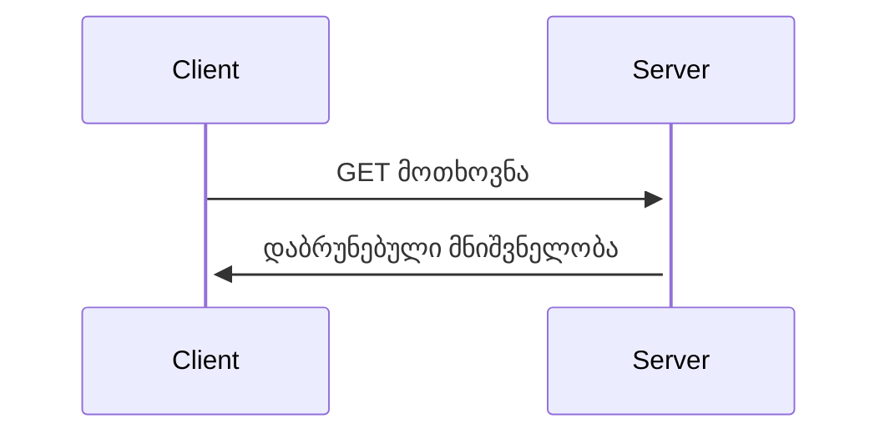

ვებგვერდზე დინამიურობისთვის საჭიროა სერვერთან კომუნიკაცია. სერვერთან კომუნიკაცია შესაძლებელია ძირითად ორი გზით:

- HTTP/HTTPS მოთხოვნები
  - `REST API` - Front-End-ის (**კლიენტის**) მხარე უგზავნის HTTP მოთხოვნას (`GET`, `POST`, `PUT`, `PATCH`, `DELETE`) Back-end-ის (**სერვერის**) მხარეს, რომელიც აბრუნებს მნიშვნელობას მეტწილადად `JSON` ან `XML` ფორმატით.
  - `GraphQL` - `REST` მიდგომის ალტერნატივა.
- WebSockets
  - ორმხრივი გზა კლიენტსა და სერვერს შორის კომუნიკაციისთვის, კარგია ისეთი აპლიკაციებისთვის სადაც საჭიროა სწრაფად ინფორმაციის განახლება (ჩათი, შეტყობინებები და ა.შ).

## რა არის REST API?

HTTP/HTTPS მოთხოვნებისთვის გამოიყენება REST API. REST (Representational State Transfer)-ის ძირითადი იდეა არის, რომ კლიენტსა და სერვერს შორის მოხდეს ინფორმაციის მიმონაცვლეობა. API (Application Programming Interface) იშიფრება, როგორც აპლიკაციის პროგრამული ინტერფეისი, რომელიც აღწერს სხვადასხვა მეთოდებსა და მნიშვნელობებს.

REST API გააჩნია ხუთი მოთხოვნა:

- `GET` - მონაცემების მიღების მოთხოვნა.
- `POST` - მონაცემების გაგზავნის / ჩაწერის მოთხოვნა.
- `PUT` - მონაცემების სრულიად განახლების მოთხოვნა.
- `PATCH` - მონაცემების ნაწილობრივ განახლების მოთხოვნა.
- `DELETE` - მონაცემების წაშლის მოთხოვნა.

მოთხოვნას იწყებს კლიენტის მხარე და სერვერი აბრუნებს მნიშვნელობას.



### GET

`GET` მოთხოვნა გამოიყენება ინფორმაციის მისაღებად. შეგვიძლია `query` პარამეტრებით დამატებითი ინფორმაცია მივაწოდოთ სერვერს თუმცა `body`-ს გაგზავნა არ შეგვიძლია. `body` ეს არის ობიექტი, რომელიც შეგვიძლია სერვერს გავუგზავნოთ, როგორც დამატებითი ინფორმაცია.

მაგალითისთვის შეგვიძლია განვიხილოთ [`everrest`](https://everrest.educata.dev/)-ის ერთ-ერთ მოთხოვნა: _შემთხვევითი ციტატის მოთხოვნა_.

<iframe data-url="guides/javascript-random-quote" data-title="შემთხვევითი ციტატა" data-height="280"></iframe>

ამ შემთხვევაში სერვერს ვუგზავნით მოთხოვნას, რომ დაგვიბრუნოს შემთხვევითი ციტატა, რომელიც შემდგომ გამოგვაქვს ვიზუალზე.

### POST

`POST` მოთხოვნა გამოიყენება ინფორმაციის ჩასაწერად ან ისეთი მოთხოვნის გასაგზავნას სადაც საჭიროა გვქონდეს `body`.

<iframe data-url="guides/javascript-generate-qr" data-title="QR კოდის დაგენერირება" data-height="650"></iframe>

ამ შემთხვევაში სერვერს ვუგზავნით ტექსტს, რის მიხედვითაც სერვერი გამოგვიგზავნის QR კოდზე ინფორმაციას.

მაგალითად, გაგზავნილი ინფორმაცია:

```json
{
  "text": "https://iswavle.com"
}
```

დაბრუნებული მნიშვნელობა:

```json
{
  "text": "https://iswavle.com",
  "type": "png",
  "format": "base64",
  "errorCorrectionLevel": "M",
  "result": "data:image/png;base64,iVBORw0KGgoAAAANSUhEUgAAAIQAAACECAYAAABRRIOnAAAAAklEQVR4AewaftIAAAOjSURBVO3BQY4jSQIDQWdA//+ybx3mwFMAglI1Pb00iz+Y+cdhphxmymGmHGbKYaYcZsphphxmymGmHGbKYaYcZsphphxmymGmvPhQEn6Tyk0SblRuktBUbpLQVFoSfpPKJw4z5TBTDjPlxcNUnpSEd6i0JLQkNJWbJDxJ5UlJeNJhphxmymGmvPiyJLxD5R1JaCo3KjcqLQlN5UlJeIfKNx1mymGmHGbKi79MEprKTRLekYSm8jc5zJTDTDnMlBf/51RaEprKTRKayn/ZYaYcZsphprz4MpU/SRJuVFoSblQ+ofInOcyUw0w5zJQXD0vCv0mlJaGptCS8Q6UloancJOFPdpgph5lymCkvPqTyJ1NpSWgq36TyX3KYKYeZcpgp8QcfSEJTaUl4ksonknCj8qQkPEnlmw4z5TBTDjPlxYdUWhJuVG6S0FRuknCjcqPSktBU3pGEptKS0FTekYSm8qTDTDnMlMNMiT/4oiTcqLQk3KjcJOFGpSXhSSotCTcqLQlNpSXhRuUTh5lymCmHmRJ/8KAkNJWWhHeovCMJT1JpSXiHyk0Smso7ktBUPnGYKYeZcpgpLx6m8qQkNJWWhKbSktBUWhKaSkvCjUpLQktCU3lHEn7TYaYcZsphpsQffCAJNyotCU2lJaGptCQ0lX9TEm5UWhKaSktCU2lJaCpPOsyUw0w5zJQXD1NpSWgqNyotCe9IwidUbpLQVFoSWhJukvCJJDSVTxxmymGmHGbKiy9TaUm4UWkqLQk3Ki0JNyo3SbhJwo1KS8KNyo1KS8KTDjPlMFMOM+XFlyXhRqUl4UblHSotCe9QuUnCTRI+kYSm0lSedJgph5lymCnxB/9hSWgq70jCk1TekYQbld90mCmHmXKYKS8+lITfpNJUWhJuVJpKS8KNSkvCTRKayo1KS8I7VD5xmCmHmXKYKS8epvKkJNwkoam8Iwk3Kp9QeUcSmkpLQlN50mGmHGbKYaa8+LIkvEPl36TSkvCOJHxCpSWhqbQkNJVPHGbKYaYcZsqLv0wSmsqNyo1KS8InVFoSWhJukvBNh5lymCmHmfLiL5eEd6jcqDxJpSXhRqUl4UmHmXKYKYeZ8uLLVL5JpSWhqbQkNJWbJDSVloSm0pLwCZXfdJgph5lymCkvHpaE35SEmyR8QuVGpSXhSUn4TYeZcpgph5kSfzDzj8NMOcyUw0w5zJTDTDnMlMNMOcyUw0w5zJTDTDnMlMNMOcyUw0z5H/YQqQhLFYXqAAAAAElFTkSuQmCC"
}
```

### PUT

`PUT` მოთხოვნა გამოიყენება მაშინ, როცა გვსურს ინფორმაციის სრული განახლება.

მაგალითისთვის გვაქვს არარელაციური მონაცემთა ბაზა:

```json
{
  "users": [
    {
      "name": "John",
      "lastName": "Doe",
      "email": "john@doe.com",
      "age": 50
    }
  ]
}
```

`PUT` მოთხოვნა მოისაზრებს, მთლიანად ობიექტის შეცვლას, ამ შემთხვევაში ყოველი თვისების შეცვლა.

### PATCH

`PATCH` მოთხოვნა გამოიყენება მაშინ, როცა გვსურს ერთი ან რამდენიმე ინფორმაციის განახლება. მაგალითისთვის, მხოლოდ სახელი, რომ შევცვალოთ მომხარებლის ან სხვა თვისებებიც.

### DELETE

`DELETE` მოთხოვნა გამოიყენება მაშინ, როცა გვსურს მნიშვნელობის წაშლა.

## მოთხოვნის სტრუქტურა

თითოეულ მოთხოვნას გააჩნია `headers`. ჰედერები ეს არის ობიერქტი, სადაც განსაზღვრულია მოთხოვნისთვის შესაბამისი ინფორმაცია.

ძირითადი დანიშნულება ჰედერების:

- **მეტადატა**: დამატებითი ინფორმაცია მოთხოვნის შესახებ, როგორიცა: კონტენტის ტიპი, ზომა, ენკოდირება და სხვა.
- **კლიენტის** ინფორმაცია: ბრაუზერის ტიპი, მომხარებელის მისამართი და სხვა.
- **მორგებული** ინფორმაცია: კლიენტზე მორგებული ინფორმაცია, როგორიცა: ენა, კონტენტის ტიპი ან სხვა.
- **აუთენტიფიკაცია**: ტოკენები ან ქუქის ნაწილები, რომლებსაც შეუძლია მომხარებლის აუტენტიფიკაცია სერვერისთვის.
- **ქეშირება**: ქეშირების მიდგომები.

ჰედერები შეგვიძლია დავყოთ 3 ნაწილად:

- **General** - ზოგადი:
  - Request URL: რომელ სერვერზე მიდის მოთხოვნა.
  - Request Method: მოთხოვნის ტიპი (`GET`, `POST` და ა.შ).
  - [Status Code](#სტატუს_კოდი): მოთხოვნის შესაბამისი სტატუს კოდი.
  - Remote Address: IP მისამართ, რასაც სერვერი დაინახავს.
  - Referrer Policy: რამდენი [რეფერენტის ინფორმაცია](https://developer.mozilla.org/en-US/docs/Web/Security/Referer_header:_privacy_and_security_concerns) უნდა იყოს განსაზღვრული მოთხოვნაში.
- **Resposne Headers** - სერვერის მხრიდან დაბრუნებული ჰედერის მნიშვნელობები, რომელიც განსაზღვრავს თუ როგორი სახით უნდა გამოიყენოს ეს ინფორმაცია კლიენტმა:
  - `Content-Type`: როგორი ტიპის ინფორმაცია არის გამოგზავნილი სერვერიდან (HTML, JSON თუ სხვა).
  - `Content-Length`: განსაზღვრავს დაბრუნებული მნიშვნელობის ზომას ბიტებში.
  - `Date`: რა დროს დამუშავდა მოთხოვნა სერვერის მხარეს.
  - `Server`: პროგრამული ნაწილი, რომელსაც სერვერი იყენებს მოთხოვნის დამუშავებისთვის.
  - `Set-Cookie`: სერვერის მხრიდან გამოგზავნილი ქუქის მნიშვნელობა, რომელიც კლიენტის მხარეს უნდა მოთავსდეს.
  - `Cache-Control`: ქეშირების მიდგომა, თუ რა ნაწილის შენახვა უნდა მოხდეს კლიენტის მხარეს.
  - `ETag`: ქეშირებისთვის გამოყენებული ინფორმაცია, რომელიც განსაზღვრავს უნიკალურ მაიდენტიფიცირებელ მნიშვნელობას.
  - `Access-Control-Allow-Origin`: განსაზღვრავს თუ რომელ დომეინებს აქვს წვდომა სერვერის ამ რესურსზე.
- **Request Headers** - კლიენტის მხრიდან გაგზავნილი ინფორმაცია, რომელიც სერვერს ეხმარება მოთხოვნის დამუშავებაში:
  - `Host`: დომეინის ძირი ნაწილი, რასაც უკავშირდება
  - `User-Agent`: კლიენტის პროგრამა, რომელმაც გააგზავნა მოთხოვნა (მაგ: `Mozilla/5.0 (Windows NT 10.0; Win64; x64) AppleWebKit/537.36 (KHTML, like Gecko) Chrome/127.0.0.0 Safari/537.36`).
  - `Accept`: კონტენტის ტიპი, რომელიც შეუძლია კლიენტმა დაამუშავოს (მაგ: `text/html`, `application/json` და სხვა).
  - `Accept-Encoding`: განსაზღვრავს კონტენტის ენკოდირებას, რომელიც შეუძლია კლიენტმა დაამუშავოს.
  - `Accept-Language`: განსაზღვრავს ენას, რომლის გამოყენებაც შეუძლია კლიენტს.
  - `Authorization`: კლიენტის მხრიდან გაგზავნილი ტოკენი, რომლის გამოყენებაც შეუძლია სერვერს კლიენტის იდენტიფიცირებისთვის.
  - `Content-Type`: ინფორმაციის ტიპი, რომელიც გაგზავნილი იქნება `body` ობიექტის გამოყენებით.
  - `Content-Length`: გაგზავნილი კონტენტის მოცულობა ბიტებში.
  - `Cookie`: ქუქის მნიშვნელობები, რომლებიც უნდა გაიგზავნოს.
  - `Referer`: მისამართი URL სახით თუ საიდანაც იგზავნება მოთხოვნა.
  - `Origin`: მოთხოვნის სრული მისამართი, პროტოკოლი, პორტი თუ საიდანაც იგზავნება მოთხოვნა.
  - `Connection`: განსაზღვრავს ქსელის ღიად დარჩენას მოთხოვნის დასრულებამდე.

ჰედერები თითოეულ მოთხოვნაზე შესაძლებელია იყოს განსხვავებული, ასევე იყოს ჩვენი (custom) ჰედერებიც.

## სტატუს კოდი

მოთხოვნის დასრულებისას სერვერი აგზავნის სტატუს კოდს იმის მიხედვით თუ როგორ დამუშავდა მოთხოვნა.
სტატუს კოდებისთვის არსებობს [სტანდარტული](https://developer.mozilla.org/en-US/docs/Web/HTTP/Status) ჩამონათვალი თუმცა ნებისმიერ ბექენდ დეველოპერს შეუძლია თავისი სტატუს კოდიც გამოაგზავნოს. სტატუს კოდი ყოველთვის იქნება რიცხვითი სახით წარმოდგენილი.

:::info
კონსისტენტურობისთვის თითქმის ყოველი კარგი აპლიკაცია იყენებს სტანდარტულ სტატუს კოდებს.
:::

სტატუს კოდები შეგვიძლია დავყოთ ხუთ ნაწილად:

1. [ინფორმაციული სტატუს კოდები](https://developer.mozilla.org/en-US/docs/Web/HTTP/Status#information_responses) (`100` - `199`).
2. [წარმატებული სტატუს კოდები](https://developer.mozilla.org/en-US/docs/Web/HTTP/Status#successful_responses) (`200` - `299`).
3. [გადამისამართების სტატუს კოდები](https://developer.mozilla.org/en-US/docs/Web/HTTP/Status#redirection_messages) (`300` - `399`).
4. [კლიენტის შეცდომების სტატუს კოდები](https://developer.mozilla.org/en-US/docs/Web/HTTP/Status#client_error_responses) (`400` - `499`).
5. [სერვერის შეცდომების სტატუს კოდები](https://developer.mozilla.org/en-US/docs/Web/HTTP/Status#server_error_responses) (`500` - `599`).

ძირითადი სტატუს კოდები, რასაც მეტწილადად იხილავთ:

| სტატუს კოდი                                                           | სახელი                | აღწერა                                                                                                                                          |
| --------------------------------------------------------------------- | --------------------- | ----------------------------------------------------------------------------------------------------------------------------------------------- |
| [`200`](https://developer.mozilla.org/en-US/docs/Web/HTTP/Status/200) | OK                    | მოთხოვნა შესრულდა წარმატებულად და სერვერმაც დააბრუნა მნიშვნელობა                                                                                |
| [`201`](https://developer.mozilla.org/en-US/docs/Web/HTTP/Status/201) | Created               | მოთხოვნა შესრულდა წარმატებულად და ახალი მნიშვნელობაც შეიქმნა                                                                                    |
| [`204`](https://developer.mozilla.org/en-US/docs/Web/HTTP/Status/204) | No Content            | მოთხოვნა შესრულდა წარმატებულად, მაგრამ არანაირი კონტენტი არ არის გასაგზავნი                                                                     |
| [`301`](https://developer.mozilla.org/en-US/docs/Web/HTTP/Status/301) | Moved Permanently     | მოთხოვნილი რესურსი გადამისამართებულია სამუდამოდ ახალ მისამართზე                                                                                 |
| [`302`](https://developer.mozilla.org/en-US/docs/Web/HTTP/Status/302) | Found                 | მოთხოვნილი რესურსი დროებით გადამისამართებულია სხვა მისამართზე                                                                                   |
| [`400`](https://developer.mozilla.org/en-US/docs/Web/HTTP/Status/400) | Bad Request           | სერვერმა ვერ დაამუშავა მოთხოვნა, არასწორად გაგზავნილი მნიშვნელობების გამო                                                                       |
| [`401`](https://developer.mozilla.org/en-US/docs/Web/HTTP/Status/401) | Unauthorized          | სერვერმა ვერ დაამუშავა მოთხოვნა, რადგან მომხარებელი არ არის ავტორიზირებული                                                                      |
| [`403`](https://developer.mozilla.org/en-US/docs/Web/HTTP/Status/403) | Forbidden             | სერვერმა ვერ დაამუშავა მოთხოვნა, რადგან ამ მომხარებელს არ აქვს შესაბამისი უფლება                                                                |
| [`404`](https://developer.mozilla.org/en-US/docs/Web/HTTP/Status/404) | Not Found             | სერვერმა ვერ დაამუშავა მოთხოვნა, რადგან არსებული რესურსი ვერ მოიძებნა                                                                           |
| [`405`](https://developer.mozilla.org/en-US/docs/Web/HTTP/Status/405) | Method Not Allowed    | სერვერმა ვერ დაამუშავა მოთხოვნა, რადგან მეთოდი არ არის დაშვებული                                                                                |
| [`409`](https://developer.mozilla.org/en-US/docs/Web/HTTP/Status/409) | Conflict              | სერვერმა ვერ დაამუშავა მოთხოვნა, რადგან წარმოიქმნა არსებულ რესურსთან პრობლემა (მაგ: მომხარებელი ცდილობს მეორეჯერ იგივე იმეილით დარეგისტრირებას) |
| [`422`](https://developer.mozilla.org/en-US/docs/Web/HTTP/Status/422) | Unprocessable Entity  | სერვერმა ვერ დაამუშავა მოთხოვნა, რადგან გაგზავნილი მნიშვნელობა (მედია, ფაილი ან ტექსტი) ვერ ან არ დამუშავდება                                   |
| [`429`](https://developer.mozilla.org/en-US/docs/Web/HTTP/Status/429) | Too Many Requests     | სერვერმა ვერ დაამუშავა მოთხოვნა, რადგან ამ მისამართიდან ან მომხარებლიდან უკვე ბევრი მოთხოვნა გამოიგზავნა                                        |
| [`500`](https://developer.mozilla.org/en-US/docs/Web/HTTP/Status/500) | Internal Server Error | სერვერმა ვერ დაამუშავა მოთხოვნა, რადგან სერვერზე წარმოიქმნა გაუთვალისწინებელი შეცდომა                                                           |
| [`503`](https://developer.mozilla.org/en-US/docs/Web/HTTP/Status/503) | Service Unavailable   | სერვერმა ვერ დაამუშავა მოთხოვნა, რადგან სერვისზე წვდომა დროებითად დაუშვებელია                                                                   |

შეგიძლიათ ყოველ სტატუს კოდს გაეცნოთ [MDN-ის](https://developer.mozilla.org/en-US/docs/Web/HTTP/Status) ვებგვერდზე ან იხილოთ სახალისო ილუსტრაციები სტატუს კოდებით:

- [კატების მოყვარულთათვის](https://http.cat/).
- [ძაღლების მოყვარულთათვის](https://http.dog/).

## Network

ნებისმიერ ვებგვერდზე შეგიძლიათ ნახოთ თუ როგორი სახით იგზავნება და მიიღება ინფორმაცია. ამისათვისა საჭირაო გახსნათ დეველოპერის ხელსაწყო `inspect` და შემდგომ არიჩიოთ `network` ტაბი.

`inspect` გახსნა შეიძლება ვებგვერდზე კონტექსტური მენიუზე დაკლიკებით (მაუსის მარჯვენა ღილაკით) და შემდგომ `inspect`-ის არჩევით ან მალსახმობით:

- Windows/Linux: <kbd>CTRL</kbd> <kbd>Shift</kbd> <kbd>I</kbd> ან <kbd>F12</kbd>
- macOS: <kbd>Cmd</kbd> <kbd>Option</kbd> <kbd>I</kbd>

`network`-ის ტაბში გახსნის შემდგომ, შეგიძლიათ აირჩიოთ ნებისმიერი მოთხოვნა სადაც უფრო დეტალური აღწერა იქნება მოთხოვნის შესახებ (Headers, Payload, Preview, Response, Initiator, Timing და სხვა).

## შეჯამება

ვებგვერდზე კონტენტის დინამიურად ჩასატვირთად საჭიროა სერვერთან კომუნიკაცია. კლიენტი ითხოვს კონტენტს, ხოლო სერვერი უგზავნის მას სხვადასხვა გზით. ყველაზე მარტივად და ფართოდ გამოყენებული არის REST API, რომელსაც არაერთ ვებგვერდზე შეხვდებით.
