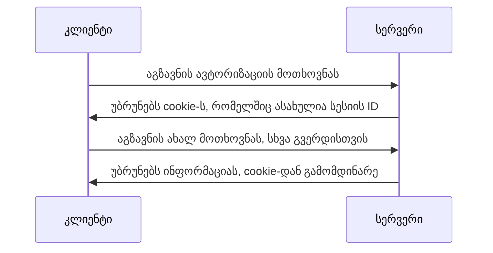

[`cookie`](https://developer.mozilla.org/en-US/docs/Web/HTTP/Cookies) არის მცირე ზომის ინფორმაცია, რომელიც
გამოიყენება სერვერთან კომუნიკაციის დროს. ბრაუზერს შეუძლია: შეინახოს cookie, შექმნას ახალი cookie, განახლოს
cookie ან საერთოდაც წაშალოს ის.

## რისთვის გამოიყენება cookie

**cookie**-ის დანიშნულება მეტწილადად არის მომხარებლის იდენტიფიცირებისთვის ან მსგავსი პერსონალური ინფორმაციის
წარსადგენად. წარმოიდგინეთ სოციალური ქსელის ვებგვერდი, სადაც მომხარებელმა გაიარა ავტორიზაცია და იხილა მისი
სიახლეები. გარკვეული დროის შემდგომ კი გათიშა ბრაუზერი ან საერთოდაც დაარეფრეშა (გადატვირთა) აპლიკაცია. ამ შემთხვევაში
სერვერი მას ვეღარ ცნობს. საჭიროა მისი კიდევ ხელახლა ავტორიზაცია.
ყოველ მოთხოვნაზე რომ ლოგინის და პაროლის შეყვანა სჭირდებოდეს, ამ შემთხვევაში მომხარებელი საშინლად დაიტანჯებოდა.
სანაცვლოდ შეგვიძლია გამოვიყენოთ cookie, რომელიც ავტორიზაციის შემდეგ შეინახავს მომხმარებლის შესახხებ მცირე ინფორმაციას.



ამრიგად ავტორიზაციის შემდგომ, სერვერი ცნობს მომხარებელს და უბრუნებს შესაბამის ინფორმაცაის cookie-დან გამომდაინრე.

Cookie-ები გამოიყენება ძირითადად სამი მიზნისთვის:

- **სესიური ინფორმაცია** - მომხარებლის ინფორმაცია, რომელიც ეხმარება სერვერს მოხმარებლის იდენტიფიცირებაში.
- **პერსონალიზაცია** - მომხარებელზე მორგებული პერსონალიზირებული ინფორმაცია, მაგალითად: სასურველი ენა, დიზაინის სტილი და ა.შ.
- **Tracking** - მომხარებლის ქცევების ანალიზი და მისი დამახსოვრება.

## მონაცემთა შენახვა

უწინ არ იყო ვებში cookie-ს გარდა სხვა ალტერნატივა, რომ ინფორმაცია შეგვენახა. თუმცა დღესდღეისობით გვაქვს ბევრი კარგი ალტერნატივა,
როგორიცა:
[ლოკალური საცავი](./doc/guides/javascript/window/storages/local),
[სესიური საცავი](./doc/guides/javascript/window/storages/session)
და [IndexedDB](https://developer.mozilla.org/en-US/docs/Web/API/IndexedDB_API).

:::info
თითოეულ საცავს გააჩნია თავისი დანიშნულება და მისი გამოყენების პრინციპები. cookie არის ყველაზე მცირე ტევადობის საცავი, ამიტომაც მასში ჯობია შევინახოთ ის ინფორმაცია,
რაც ზემოთ არის აღწერილი. სხვადასხვა საცავების ტევადობის ზომები იხილეთ [შემაჯამებელ სტატიაში](./doc/guides/javascript/window/storages/summary).
:::

:::warning
ბევრი Cookie-ს შენახვაც არ არის კარგი მიდგომა, რადგან თუ მომხარებელი აქვს ნელი ინტერნეტი,
შესაძლებელია თითოეული ამ cookie-ის გაგზავნამ მოთხოვნის დროს გაზარდოს ჩატვირთვის დრო.
:::

## Cookie-ზე მოქმედებები

Cookie-ს მეტწილადად სერვერი ამზადებს და გვიგზავნის. თუმცა კლიენტის მხარესაც არის შესაძლებელი cookie-ს შექმნა.

დოკუმენტის მხარეს გვაქვს თვისება [`document.cookie`](https://developer.mozilla.org/en-US/docs/Web/API/Document/cookie), სადაც ინახება თითოეული cookie-ის ინფორმაცია.

```js
document.cookie = 'name=Educata';
document.cookie = 'api=EverREST';
```

ამ კოდით შევქმენით ორი cookie, რომლის დასახელებაც არის `name` და `api`, ხოლო მათი მნიშვნელობები კი - `Educata` და `EverREST`.

Cookie შეგიძლიათ იხილოთ developer tools-ში: inspect -> application -> cookie


თითოეულ cookie-ს გააჩნია შემდგომი თვისებები:

- **Name** - Cookie-ს დასახლება. თითოეულ cookie-ს უნდა გააჩნდეს უნიკალური სახელი, სხვა შემთხვევაში ახლად დამატებული გადააწერს წინა cookie-ს მნიშვნელობებს.
- **Value** - Cookie-ს მნიშვნელობა.
- **Domain** - რომელი დომეინს აქვს მისი გამოყენების უფლება. თუ არაფერი არ არის განსაზღვრული მაშინ cookie-ს გამოყენება შეუძლია მხოლოდ იმ ვებგვერდს, სადაც ის შეიქმნა. ასევე შესაძლებელია საბდომეინების გამოყოფაც, მაგალითად: `.Domain=.iswavle.com` გულისხმობს cookie-ს გამოყენება შესაძლებელია მხოლოდ იმ დომეინზე სადაც შექიმნა და ასევე საბდომეინებზეც. ჩვენს შემთხვევაში თუ cookie შეიქმნა `iswavle.com`-ზე მაშინ მისი გამოყენება შესაძლებელი იქნება, როგორც `iswavle.com`-ზე ასევე `practice.iswavle.com`.
- **Path** - რომელი URL-სთვის არის მისი გამოყენება ნებადართული. მაგალითად თუ არის `/` ვებგვერდის ნებისმიერი ადგილიდან შეიძლება მისი გამოყენება.
- **Expires** / Max-Age - როდის წაიშალოს cookie. თუ არ მივუთითებთ ნაგულისხმევად მიენიჭება სესიური მნიშვნელობა.
  - **Expires** - განსაზღვრავს კონკრეტულ თარიღს. მაგალითად: `Expires=Tue, 22 Jul 2025 12:00:00 UTC` განსაზღვრავს, რომ cookie-ს მნიშვნელობა მოქმედია 2025 წლის 22 ივლისამდე.
  - **Max**-Age - განსაზღვრავს შექმნიდან რა დროში წაიშალოს. მაგალითად: `Max-Age=3600` გულისხმობს, რომ cookie ვალიდურია 1 საათის განმავლობაში (1 საათი = 3600 წამს).
- **Size** - Cookie-ს ზომა, რომელიც მოცემულია ბაიტებში. უმეტესი ბრაუზერი იყენებს 4096 ბაიტს მაქსიმალური ზომისთვის, რაც არის 4 კილობაიტი. თუ ამ ზომას გადაცდებით შეიძლება cookie არ დაყენდეს.
- **HttpOnly** - განსაზღვრავს წვდომას `document.cookie`-სთან მიმართებაში. თუ `HttpOnly` არის დაყენებული იგულისხმება, რომ კლიენტს არ შეუძლია მისი გამოყენება JavaScript-ით. ეს თვისება კარგია უსაფრთხოებისთვის, რომ კლიენტის მხარეს კოდმა, ყოველთვის არ მიიღოს cookie-ზე წვდომა.
- **Secure** - განსაზღვრავს წვდომის დონეს პროტოკოლისთვის. თუ Secure მითითებულია cookie-ში, იგულისხმება, რომ მხოლოდ და მხოლოდ HTTPS-ით შეიძლება მოთხოვნის გაგზავნა ამ cookie-ზე.
- **SameSite** - განსაზღვრავს წვდომას cross-site მოთხოვნების დროს. ამ თვისებით შესაძლებელია თავი ავარიდოთ Cross-Site Request Forgery-ს, იგივე CSRF-ს შეტევებს. მას გააჩნია სამი მნიშვნელობა:
  - `SameSite=Stict` - cookie არ გაგიზავნება cross-site მოთხოვნის დროს.
  - `SameSite=Lax` - cookie გაიგზავნება same-site მოთხოვნების დროს და რამდენიმე cross-site მოთხოვნის დროს (GET მეთოდის დროს).
  - `SameSite=None` - cookie გაიგზავნება cross-site მოთხოვნის დროს, მაგრამ რომ იმუშავოს, საჭიროა Secure თვისება მითითებული იყოს.
- **Partition Key Site** - [Partitioned (დანაწევრებული) cookie](https://developer.mozilla.org/en-US/docs/Web/Privacy/Privacy_sandbox/Partitioned_cookies) გამოიყენება იმისათვის, რომ cross-site მოთხოვნების დროს არ მოხდეს cookie-ზე თვალთვალი (tracking).
- **Cross Site** - თვისება განსაზღვრავს, თუ როგორ უნდა მოიქცეს cross-site მოთხოვნების დროს.
- **Priority** - Cookie-ს პრიორიტეტულობა, რომელსაც გააჩნია 3 დონე:
  - `Priority=Low` - დაბალი პრიორიტეტულობა, რომლის დროსაც cookie შესაძლოა წაიშალოს თუ მიაღწია მაქსიმალურ ტევადობას.
  - `Priority=Medium` - ნაგულისხმევი (default) პრიორიტეტულობა, არაფერი განსაკუთრებული.
  - `Priorty=High` - მაღალი პრიორიტეტულობა, მაქსიმალურად უნდა შეეცადოს ბრაუზერმა, რომ ეს cookie არ წაშალოს.

:::info
cross-site მოთხოვნა არის ისეთი ტიპის მოთხოვნა, როცა განსხვავებული ტიპის დომეინები უკავშირდება ერთმანეთს.
:::

შევქმნათ cookie, რომელიც გამოიყენებს ყოველივე ამ თვისებას:

```js
document.cookie = 'sessionID=123456789abc; Max-Age=3600; domain=.iswavle.com; path=/; HttpOnly; Secure; SameSite=Lax; Priority=High; Partitioned';
```

რადგან `HttpOnly` დავუწერეთ, cookie არ გამოჩნდება ბრაუზერის თულსში (Application) თუმცა შესაბამისი მოთხოვნის დროს გაიგზავნება სერვერთან. თუ შევქმნით
`HttpOnly`-ის გარეშე, მაშინ მას შევამჩნევთ ბრაუზერში და მისი დარედაქტირებაც შესაძლებელი იქნება. გაითვალისწინეთ `HttpOnly` უსაფრთოხებისთვის.


## CRUD მოქმედებები cookie-ზე

ბევრი დამხამრე ბიბლიოთეკა არსებობს cookie-სთან მუშაობისთვის, რომელიც გაგვიმარტივებს CRUD-ს ოპერაციებს.
რეალურად თუ უფრო კომპლექსური მოქმედეები გვჭირდება, მაშინ `document.cookie`-ს წერა მოუხერხებელია.
ამის მოსაგვარებლად დეველოპერები მიმართავენ კონკრეტულ ბიბლიოთეკებს, ან თავად ადგენენ cookie-სთან სამუშაო ინტერფეისებს.

განვიხილოთ ასეთი ინტერფეისის მარტივი მაგალითი:

```js
class CookieService {
  static setCookie(name, value, options = {}) {
    let cookieString = `${encodeURIComponent(name)}=${encodeURIComponent(value)}`;

    if (options.expires) {
      const expires = typeof options.expires === 'number' ? new Date(Date.now() + options.expires * 864e5).toUTCString() : options.expires.toUTCString();
      cookieString += `; expires=${expires}`;
    }

    if (options.path) {
      cookieString += `; path=${options.path}`;
    }

    if (options.domain) {
      cookieString += `; domain=${options.domain}`;
    }

    if (options.secure) {
      cookieString += '; secure';
    }

    if (options.httpOnly) {
      cookieString += '; HttpOnly';
    }

    if (options.sameSite) {
      cookieString += `; SameSite=${options.sameSite}`;
    }

    document.cookie = cookieString;
  }

  static getCookie(name) {
    const cookieMatch = document.cookie.match(new RegExp('(^| )' + encodeURIComponent(name) + '=([^;]+)'));
    return cookieMatch ? decodeURIComponent(cookieMatch[2]) : null;
  }

  static updateCookie(name, value, options) {
    this.setCookie(name, value, options);
  }

  static deleteCookie(name, options = {}) {
    this.setCookie(name, '', { expires: -1, ...options });
  }

  static listCookies() {
    return document.cookie.split('; ').map((cookie) => {
      const [name, value] = cookie.split('=');
      return { name: decodeURIComponent(name), value: decodeURIComponent(value) };
    });
  }

  static clear() {
    const cookies = document.cookie.split('; ');
    for (const cookie of cookies) {
      const name = cookie.split('=')[0];
      this.deleteCookie(name);
    }
  }
}

// გამოყენება
CookieService.setCookie('test', 'value', { expires: 7, path: '/', secure: true, sameSite: 'Lax' }); // cookie-ს შექმნა
console.log(CookieService.getCookie('test')); // cookie-ს წაკითხვა
CookieService.updateCookie('test', 'newValue', { expires: 7 }); // cookie-ს განახლება
console.log(CookieService.getCookie('test')); // განახლებული cookie-ს წაკითხვა
CookieService.deleteCookie('test', { path: '/' }); // cookie-ს წაშლა
console.log(CookieService.getCookie('test')); // წაშლილი cookie-ს წაკითხვა
console.log(CookieService.listCookies()); // ყოველი cookie-ს დაბრუნება
CookieService.clear(); // ყოველი cookie-ს წაშლა
```

ამრიგად მივიღეთ კლასი, რომელიც შეგვიძლია გამოვიყენოთ cookie-ზე CRUD-ის ტიპის ოპერაციების შესასრულებლად.
რადგანაც მეთოდები არის `static`-ით შექმნილი, არ არის საჭირო მეთოდის გამოყენებისთვის კლასის ახალი ინსტანციის შექმნა `new` ქივორდის გამოყენებით.

## შეჯამება

Cookie ეს არის ერთგვარი საცავი, რომელიც გამოიყენება კლიენტის მხარეს ინფორმაციის შესანახად. თითოეული cookie შეგვიძლია გავაყოლოთ მოთხოვნას.
თუ cookie-ს გააჩნია `HttpOnly` თვისება, მაშინ ის არ იქნება ხილვადი ბრაუზერისთვის. Cookie არის ყველაზე პატარა საცავი, ამიტომაც მასში ძირითადად
სამი ტიპის ინფორმაციას ვინახავთ: სესიის ინფორმაცია, პერსონალიზირებული ინფორმაცია და სათვალთვალო ინფორმაცია.
