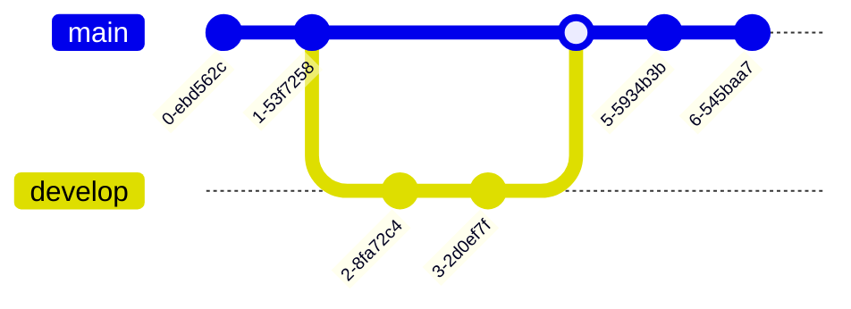

ამ ფაილში მოცემულია ყოველი ვიზუალური ელემენტი, რომელიც შეგიძლიათ გამოიყენოთ სტატიის წერისას.
ძირითადად ყველაფერი, რაც md გაფართოვებაშია მიღებული შეგიძლიათ გამოიყენოთ.

სტატიის წერისას გირჩევთ ჩაიწეროთ [Markdown All in One](https://marketplace.visualstudio.com/items?itemName=yzhang.markdown-all-in-one) ექსტენშენი.

## frontMatter

თითოეულ სტატიას ფაილის დასაწყისში საჭრიოა ჰქონდეს [frontMatter](https://jekyllrb.com/docs/front-matter/).

არსებული ფრონტმეტერის სინტაქსი:

<!-- კოდის ბლოკში მოთავსება არ არის საჭირო! მის ნაცვლად მოათავსეთ --- ში -->

```
title: სათაური;
description: აღწერა;
keywords?: სიტყვები, რომლებიც უნდა გამოჩნდეს საძიებო სისტემაში. გაითვალისწინეთ 1-3 ჩათვლით არსებულ სათაურებს ავტომატურად გამოიყენებს, როგორც ქივორდებად.
depricated?: depricated არის თუ არა ფიჩერი, რაც სტატიაშია აღწერილი
image?: ბექგრაუნდ სურათი სტატიის მეტა თეგისთვის (თუ არ არის მითითებული იქნება მისი მშობლის სურათი)
```

## სათაურის ელემენტები

სათაურის ელემენტების გამოყენება შეიძლება 1-6 ჩათვლით.

გაითვალისწინეთ TOC-ში (Table of content) გათავლისწინებული იქნება მხოლოდ 1-3 დონის ჩათვლით.
სათაურების ჩასალაგებლად მიჰყევით კლებადობით (h1 => h2 => h3).

თითოეულ სათაურის ელემენტს ავტომატურად მიენიჭება შესაბამისი იდ-ით. იდ-ები შეგიძლიათ გამოიყენოთ ნავიგაციისთვის.

მაგალითად:

```
# რაიმე სათაური
```

დარენდერდება, როგორც:

```
<h1 id="რაიმე_სათაური">რაიმე სათაური</h1>
```

შეგიძლიათ გამოიყენოთ შემდგომი სათაურის ელემენტები:

```
# სათაური 1 (h1)
## სათაური 2 (h2)
### სათაური 3 (h3)
#### სათაური 4 (h4)
##### სათაური 5 (h5)
###### სათაური 6 (h6)
```

## სიის ელემენტები

წერტილოვანი:

- პირველი ელემენტი
- მეორე ელემენტი
- მესამე ელემენტი
- ...

რიცხობრივი:

1. პირველი ელემენტი
2. მეორე ელემენტი
3. მესამე ელემენტი
4. ...

## ცხრილი

| header 1  | header 2  |
| --------- | --------- |
| Content 1 | Content 2 |
| Content 3 | Content 4 |
| Content 5 | Content 6 |

ან

| header 1  | header 2  |
| :-------- | :-------- |
| Content 1 | Content 2 |
| Content 3 | Content 4 |
| Content 5 | Content 6 |

## ნავიგაცია

ვებგვერდზე შესაძლებელია, შიდა და გარე ნავიგაცია.

[შიდა](./doc/guides/typescript/introduction) ან [გარე](https://everrest.educata.dev/)

## სურათი


## კოდი

`ინლაინ კოდი`

```
დიდი კოდი
```

```ts
let text: string = 'დიდი კოდი';
```

## live კოდი

<iframe data-url="guides/javascript-canvas-basic-animations-clock" data-title="საათის ანიმაცია" data-height="170"></iframe>

## სხვა ვებგვერდის კონტენტი

<iframe data-is-external-source="true" src="https://www.youtube.com/embed/dQw4w9WgXcQ?si=WISLAbUnjYMvgYrD" data-title="საათის ანიმაცია" data-height="500"></iframe>

<iframe data-is-external-source="true" src="https://everrest.educata.dev" data-title="საათის ანიმაცია" data-height="500"></iframe>

## ალერტები

:::
ინფო ალერტი (ნაგულისხმევი)
:::

:::info
ინფო ალერტი
:::

:::success
მწვანე ალერტი
:::

:::warning
გაფრთხილების ალერტი
:::

:::error
შეცდომის ალერტი
:::

## ჩარტები

ჩარტებისთვის გამოყენებულია [mermaid](https://mermaid.js.org/intro/getting-started.html).
მისი ნებისმიერი სინტაქსი იმუშავებს სტატიაში.

გამოყენების სინტაქსი:

<!-- მოთავსებულია კომენტარში, რადგან არასწორი კონტენტია მერმეიდის ბლოკში
```mermaid
მერმეიდი კოდი
```
-->

მაგალითად:





